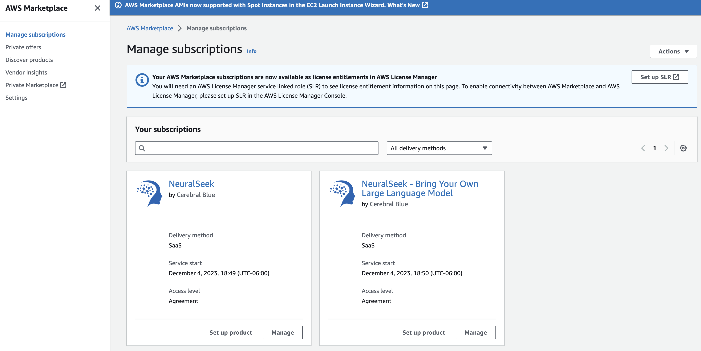
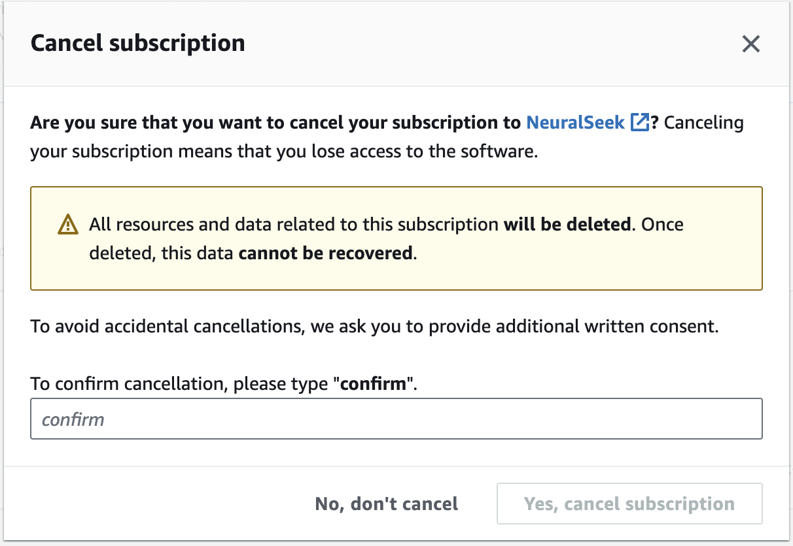

# Finishing and closing the lab
After the lab is finished, it is important to make sure that the subscriptions and instances would be deleted so that any unexpected usage cost does not incur. Failing to do so may result in unnecessary billing to occur, so it is highly recommended that you would clean up the created resources after you are finished.

## Removing the NeuralSeek subscription for AWS Lab
In order to remove the subscribed NeuralSeek, please follow the below steps.
1. Visit the <a href="https://console.aws.amazon.com/marketplace/home#/subscriptions" target="_blank">AWS Marketplace subscriptions</a> page.

2. Click the "Manage" button under the subscription.
3. In the `Agreement` section, click `Actions` and select `Cancel subscription`
4. Read and enter `confirm` to the input field, and click `Yes, cancel subscription`.

5. Check that the NeuralSeek subscription is no longer visible in the manage subscriptions page.
6. Visit the <a href="https://console.aws.amazon.com/lexv2/home#bots" target="_blank">Amazon Lex console</a>.
7. Select the bot "TestBot".
8. Click "Action", and select "Delete". Provide confirmation to the delete.
9. Visit the <a href="https://console.aws.amazon.com/lambda/home#/functions" target="_blank">Functions</a> page.
10. Select the function "learning-lab".
11. Click "Action", and select "Delete". Provide confirmation to the delete.

## Removing the Watson Assistant and NeuralSeek for IBM Lab
In order to remove the NeuralSeek instance, please follow the below steps:
1. Visit the <a href="https://cloud.ibm.com/resources" target="_blank">IBM cloud resources</a> page.
2. Search and locate the NeuralSeek instance that you have created during the lab. Click the instance name.
3. Select `Actions` and select `Delete service`
4. Click `OK`
5. Check that the NeuralSeek instance is no longer visible in the resources page.
6. Search and locate the Watson Assistant instance that you have created during the lab. Click the instance name.
7. Select `Actions` and select `Delete service`
8. Click `OK`
9. Check that the Watson Assistant instance is no longer visible in the resources page.
