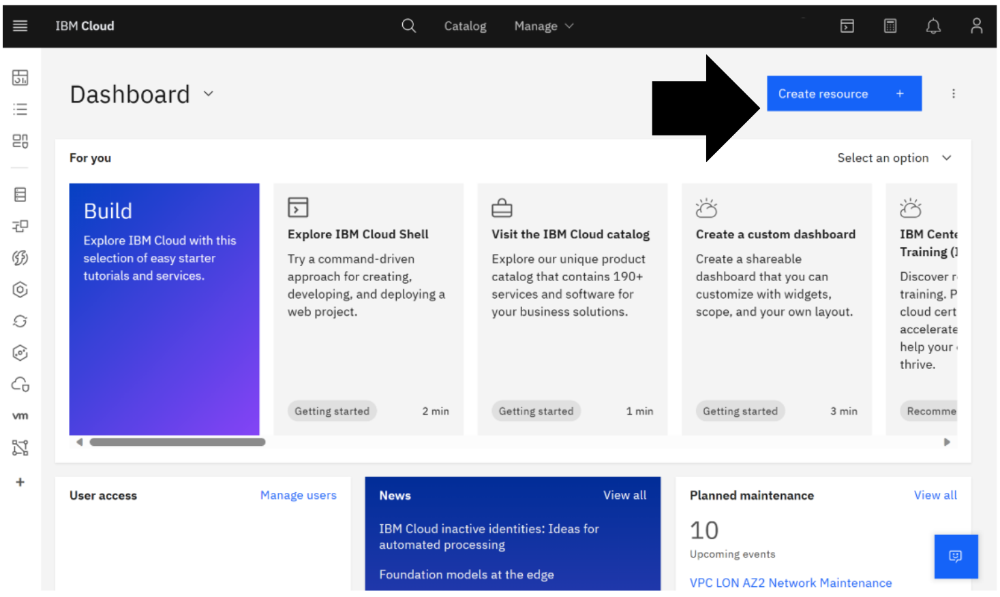
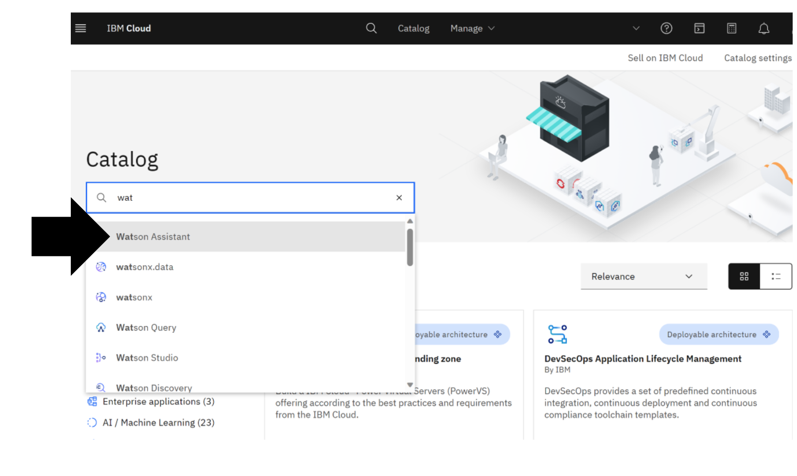
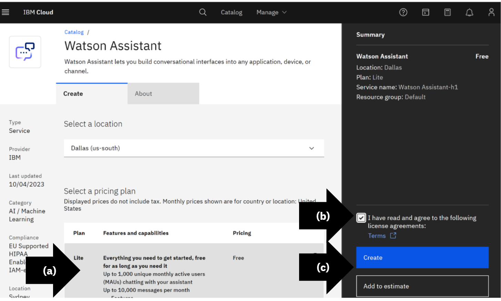
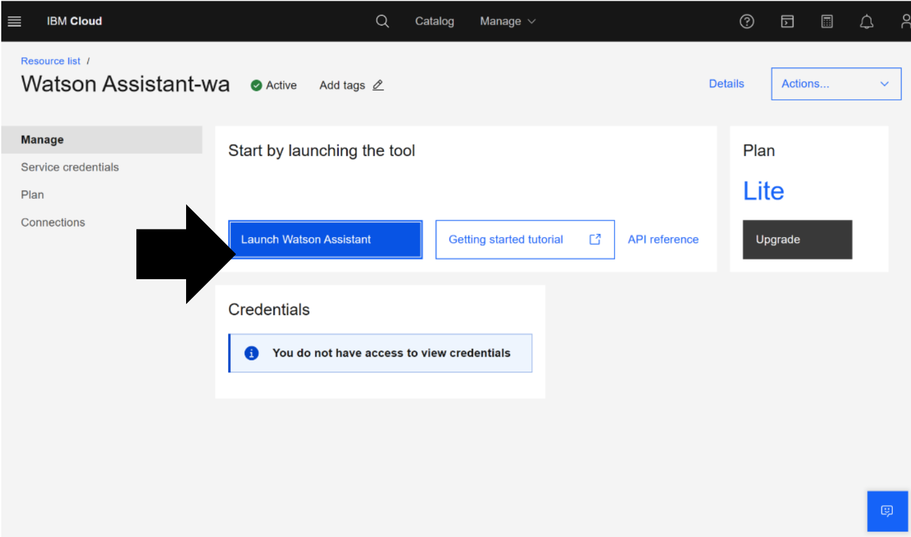
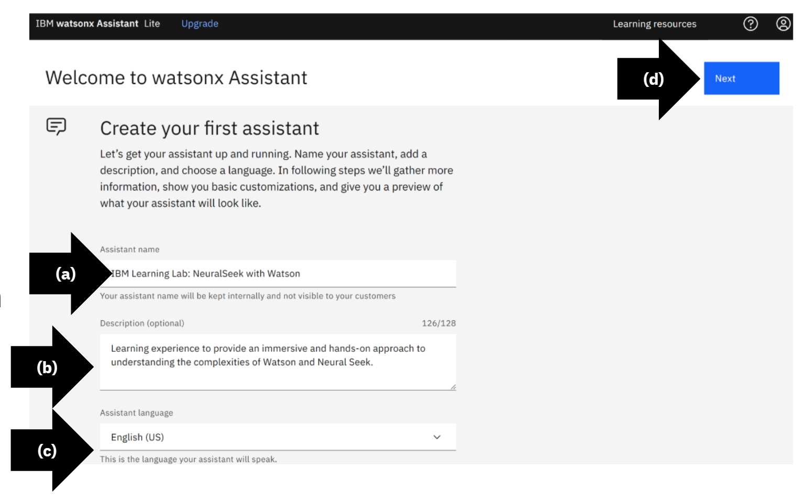
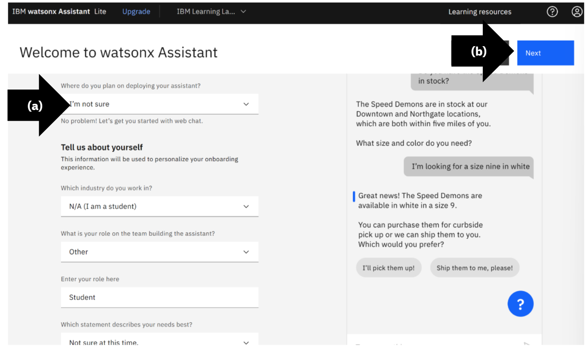
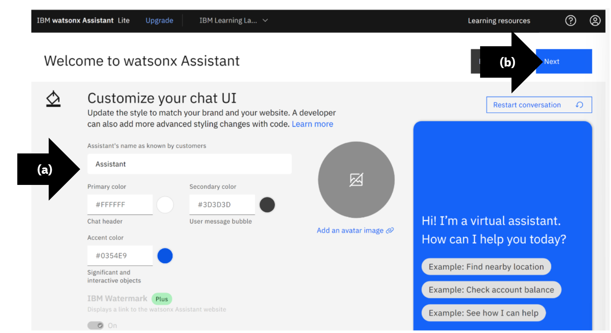
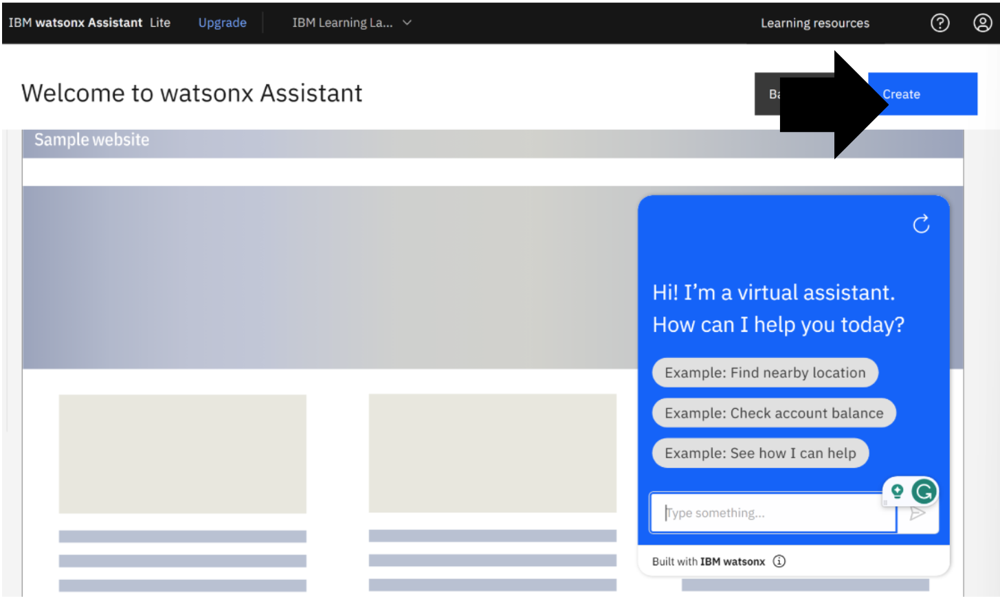

# Module 1.2

Module 1.2 is only required if you do not currently have watsonx Assistant. 
If you do have watsonx Assistant skip to [Module 1.3]({{site.baseurl}}).

## Create Resource

If you do not have watsonx Assistant, login to [IBM Cloud](https://cloud.ibm.com/login?cm_sp=ibmdev-_-developer-_-trial&_gl=1*1odtrhw*_ga*NTM2NzU0MTk0LjE2OTY1MjE4NDQ.*_ga_FYECCCS21D*MTY5Njg2NzU0Ni41LjEuMTY5Njg2ODg5OS4wLjAuMA..). 
Click “Create Resource.”
 
## Search the Catalog

Search and select “watsonx Assistant.” 

## Create a Preferred Version

* (a) Select version, in this example “Lite.”
* (b) Read the Terms and check, “I have read and agree to the following license agreements: Terms.”
* (c) Click “Create.”

## Launch watsonx Assistant

If desired, complete the “Getting Started Tutorial.” 
Click “Launch watsonx Assistant.”

## Create Your First Assistant

* (a) Type assistant name, in this example, “IBM Learning Lab: NeuralSeek with Watson”
* (b) Type optional description, in this example, “Learning experience to provide an immersive and hands-on approach to understanding the complexities of Watson and NeuralSeek.”
* (c) Select assistant language, in this example, “English.”
* (d) Click “Next.”

## Continue with the watsonx Assistant

 Complete the required information. 
 * (a) Select deployment plan, industry, team role, role, needs. 
 * (b) Click “Next.”
 
## Customize Your Chat UI

Complete the required information. 
* (a) Type assistant name, primary color, secondary color, accent color, and upload image. 
* (b) Click “Next.”

## Preview and Create

Click “Create.”
