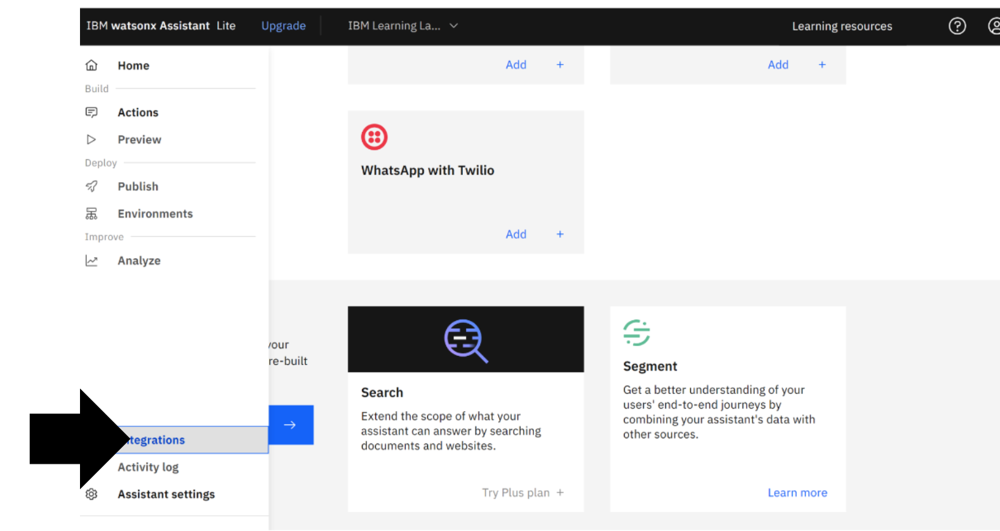
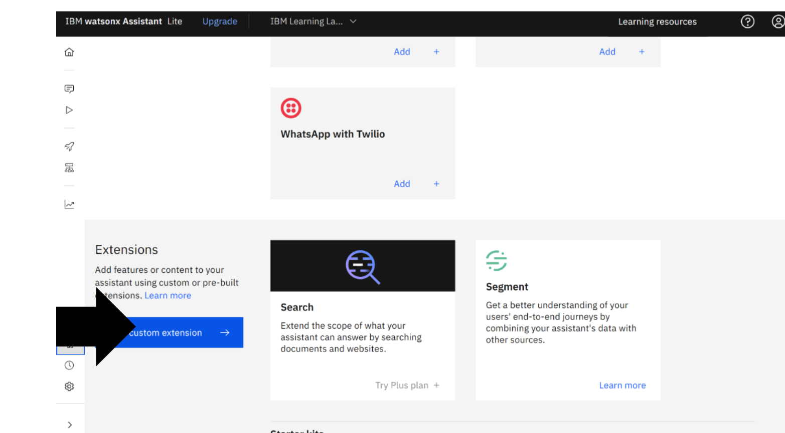
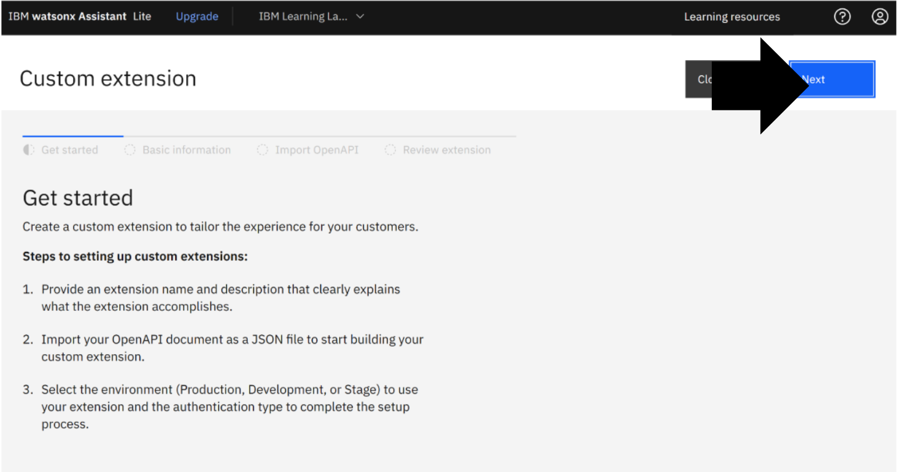
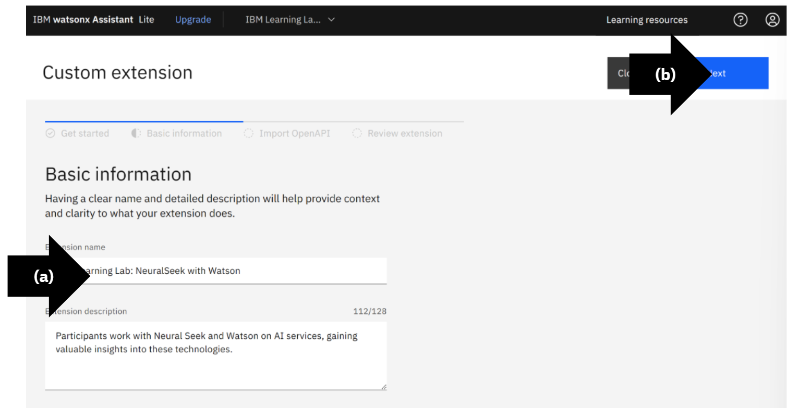
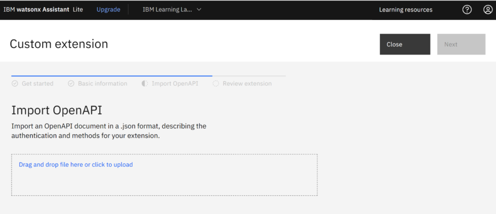
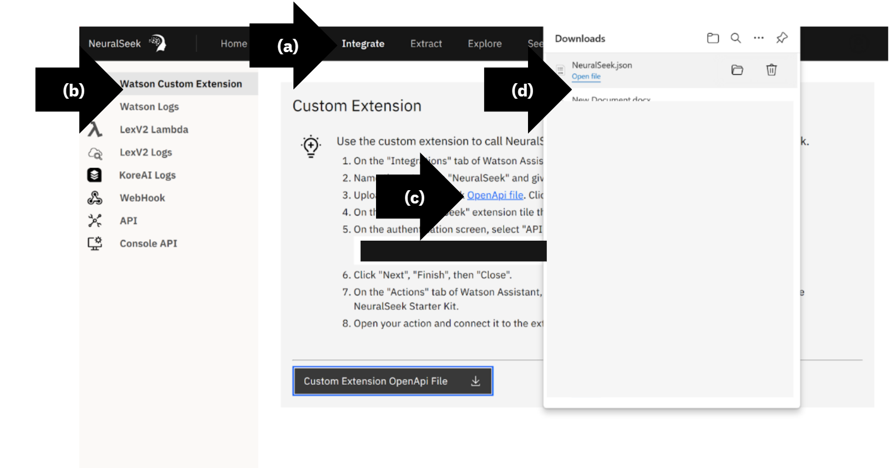
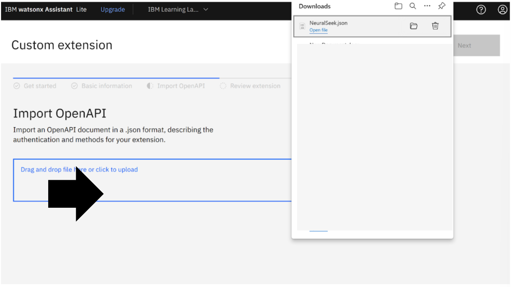
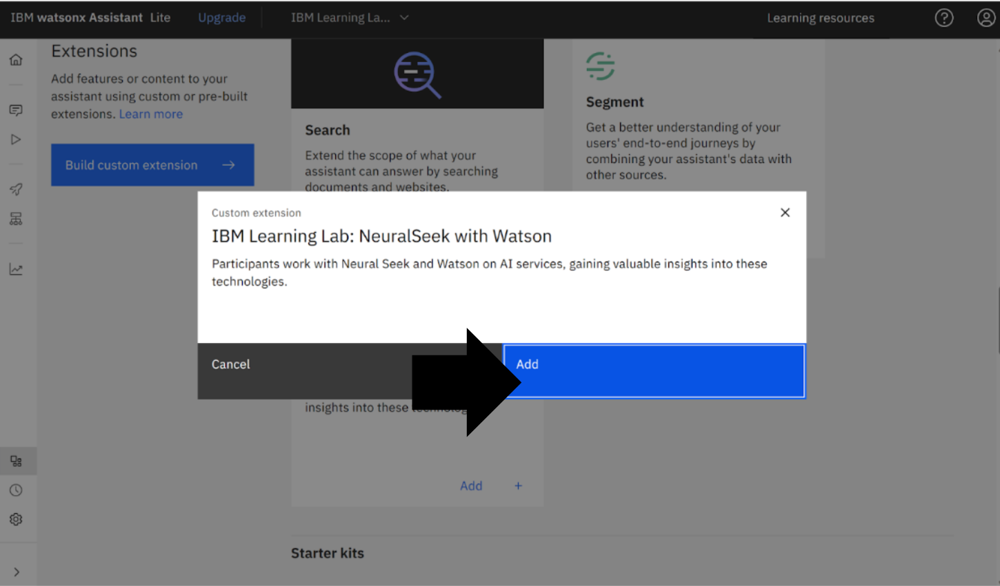

# Module 1.3

## Open Integrations

## Open Custom Extensions

## Custom Extensions Get Started

## Basic Information

## Custom Extension Import OpenAPI

## Download the NeuralSeek OpenAPI_file

## Upload the OpenAPI_file

## Complete Upload

## Complete Custome Extension

## Return to Integrations

## Add Extension

