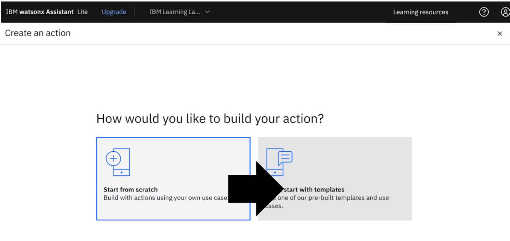
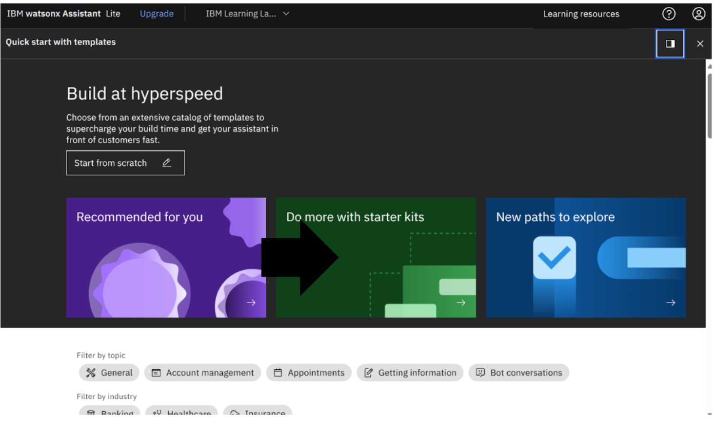
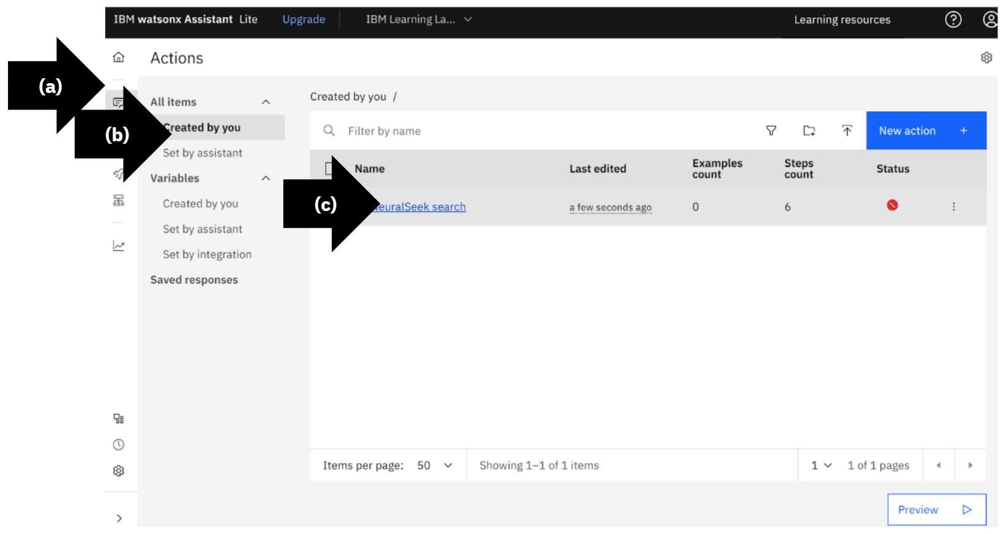
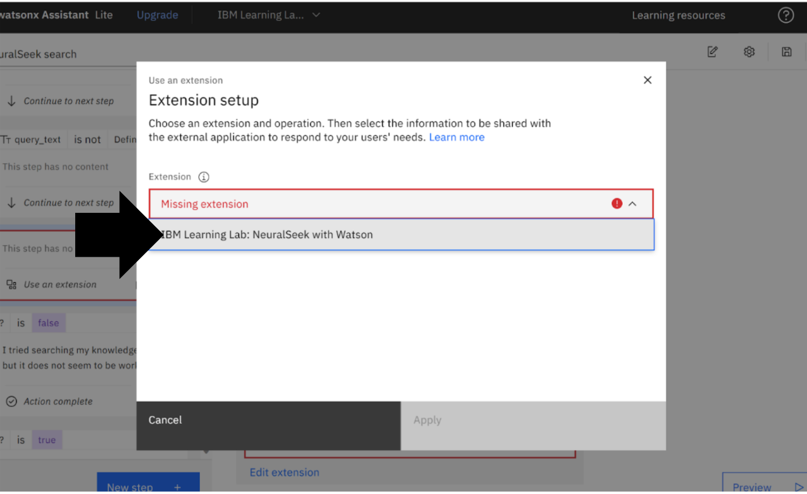
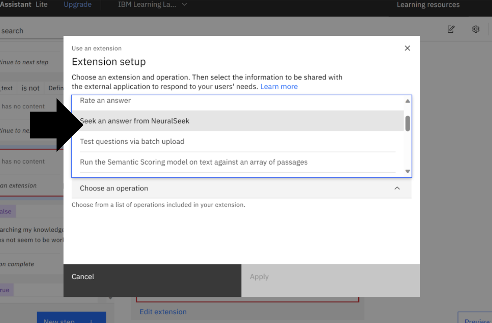
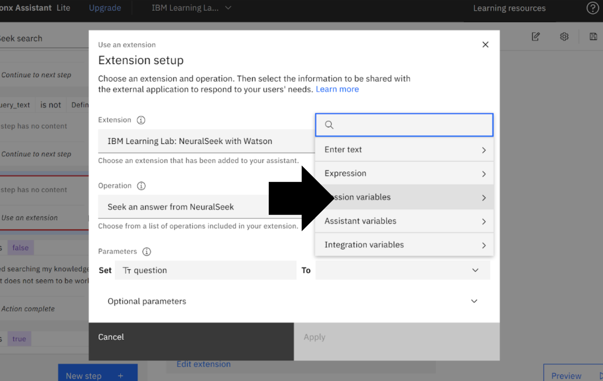

# Module 1.5: Add NeuralSeek Starter Kit Actions

## Open Actions

## Create an Action

## Build at Hyperspeed

## Quick Start with Templates

## NeuralSeek Starter Kit

## Selected Templates

## View Inactive Actions

## Customer Starts With

## Delete Assignment

## Edit Extension

## Choose an Extension

## Choose Operation

## Set Extension Parameters

## Choose Parameters

## Extension Setup

## Save Extension

## Close Extension

## Confirm Status

