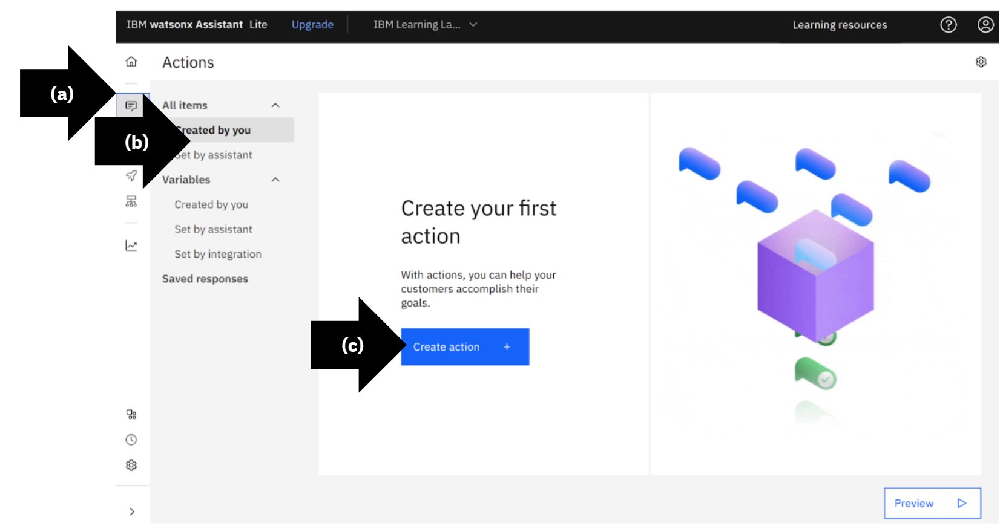
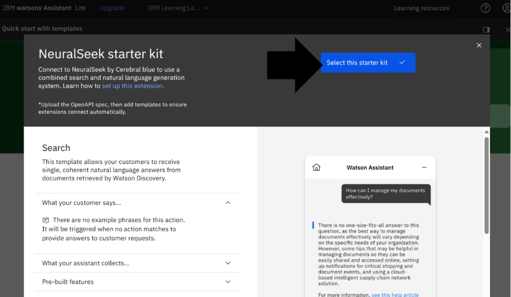
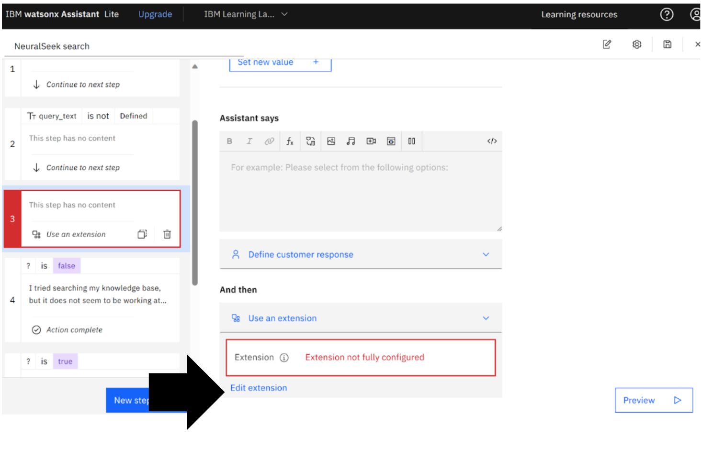
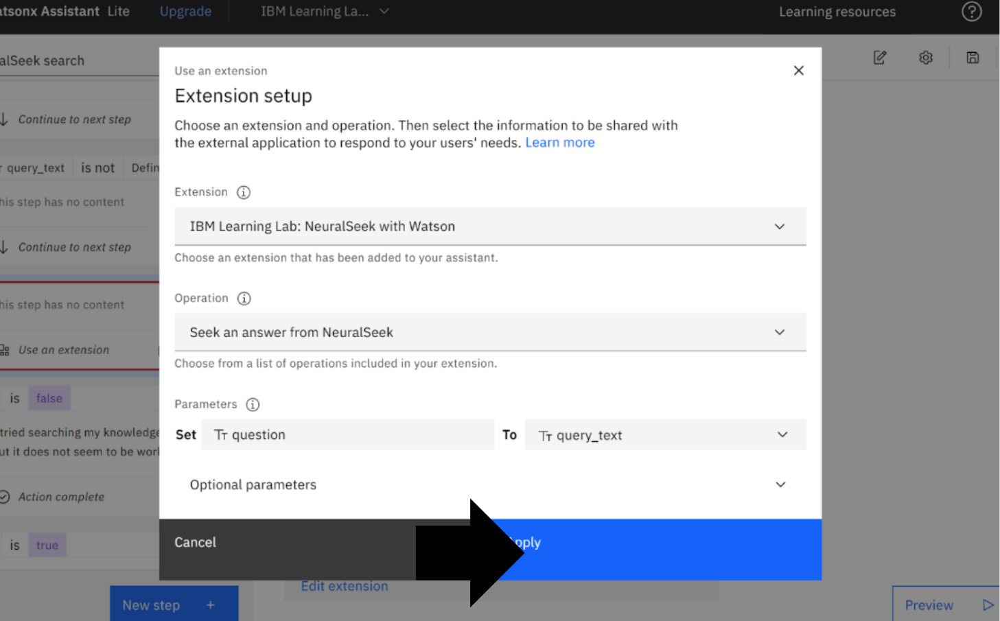
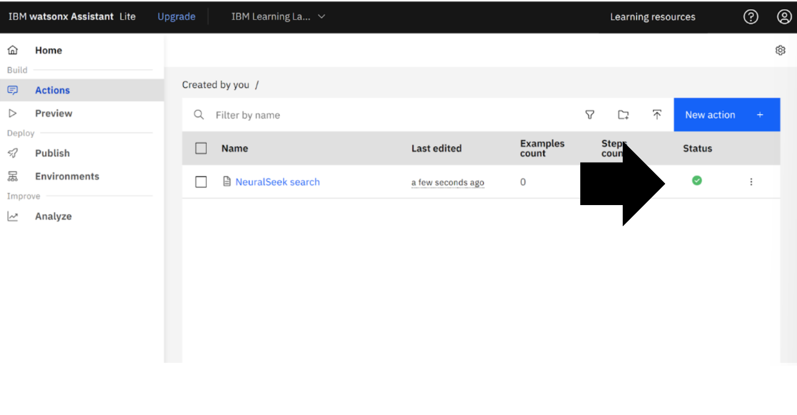

# Module 1.5: Add NeuralSeek Starter Kit Actions

## Open Actions

Open IBM Watsonx Assistant. 
* (a) On the left menu, select “Actions.”
* (b) Click “Created by you.”
* (c) Click “Create action.”

## Create an Action

Select “Quick Start with Template".

## Build at Hyperspeed

Select “Do more with starter kits”.

## Quick Start with Templates

Search and select “NeuralSeek”.

## NeuralSeek Starter Kit

Click “Start this starter kit”.

## Selected Templates

Click “Add templates".

## View Inactive Actions

* (a) On the left menu, select “Actions”.
* (b) Under All items, select “Created by you”. On the right side under status, view the red circle on “NeuralSeek search”.
* (c) Open the action, click “NeuralSeek search”.

## Customer Starts With

On the left menu, select option 3 highlighted in red “This step has no content.”

## Delete Assignment

On the right side of the set “Query_Context to Context” click “X.” 
The reason why we are deleting it is because sometimes the query context provided by watsonx Assistant can be huge and exceeds the size of the request body to the API.

## Edit Extension

Scroll down and click “Edit extension”.

## Choose an Extension

Select NeuralSeek extension, in this example it is, “IBM Learning Lab: NeuralSeek with Watson”.

## Choose Operation

Select “Seek an answer from NeuralSeek".

## Set Extension Parameters

Select “Session Variables".

## Choose Parameters

Select “query_text” from the list options.

## Extension Setup

Click “Apply".

## Save Extension

In the top right corner, click the "Save" icon. 

## Close Extension

In the top right corner, click "x" to close. 

## Confirm Status

On the right side, view the green circle with a check mark next to NeuralSeek search.
