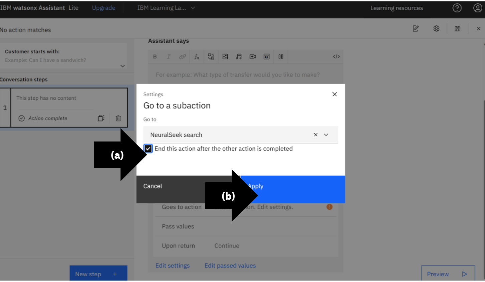

# Module 1.6: Change Default to Generative AI Responses

## Generative AI Reponses

## Delete 2 No Action Matches Count

## Confirm Delete

## Delete Conditions

## Open Preview

## View Default Responses Before Setting Up NeuralSeek Call

## Delete Default Response

## Add Subaction

## Go to a Subaction

## Check Action

## Preview NeuralSeek Generative AI Response

