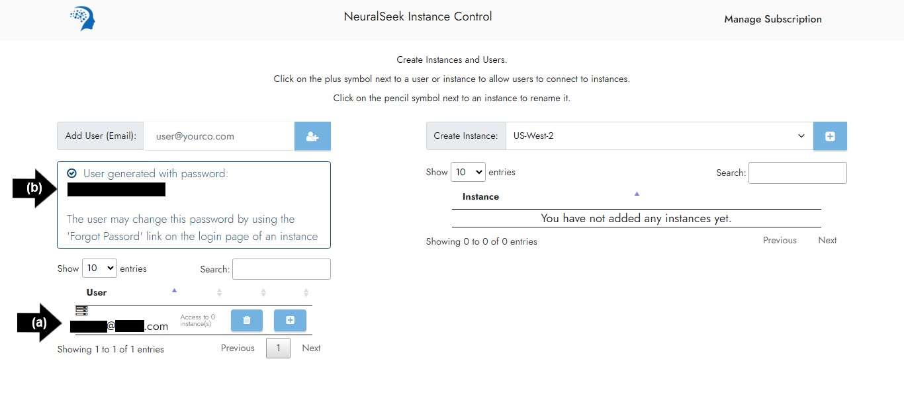
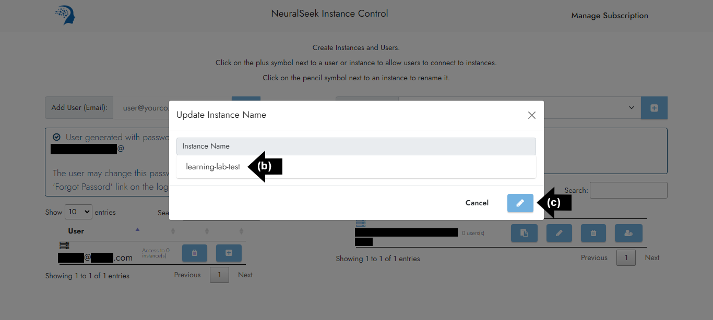

# Module 1.1 - Launch NeuralSeek

## Log in

Log in to the <a href="https://console.aws.amazon.com/marketplace/home" target="_blank">AWS Console Marketplace page</a>.

Click the yellow "Manage subscriptions" button.

## Discover products

⚠️ If you already have subscribed to NeuralSeek, you do not have to do these steps. Please move to the `Manage subscriptions` section and continue.

On the left side menu, click "Discover products".

In the "Search AWS Marketplace products" enter `NeuralSeek` and press enter. You will see two products in the search result:

### Selecting the product

If you do not have access to your own large language model (LLM), you may choose the first one which is `NeuralSeek`, which does provide our curated LLM included in it.

If you do have your own LLM, and thus have the necessary keys and region, (role access key, secret access key, and region) you can choose `NeuralSeek - Bring Your Own Large Language Model`.

⚠️ Please note that these NeuralSeek subscriptions, when created, will incur billing and cost as they are used.

## Purchasing

After you selected a product from the list, click "View purchase options" button at the top right.

Review the offer, and pricing information. When ready click `Subscribe` button under the "Purchase".

## Manage Subscriptions

Go back to your <a href="https://us-east-1.console.aws.amazon.com/marketplace/home#/subscriptions" target="_blank">Manage subscriptions</a> page.

You may either have `NeuralSeek` or `NeuralSeek - Bring Your Own Large Language Model` depending on what you chose to subscribe for the lab.

## Set up Product

Click “Set up Product” in the bottom right corner to enter the product setup page.

## Set up Account

Click “Set up your account” in the top right corner to enter the NeuralSeek instance control page.

## User Interface 

NeuralSeek's instance control page should be initially empty. Here, we need to:
1. Create a user for accessing NeuralSeek instance
2. Create an instance of NeuralSeek
3. Add created user to the created NeuralSeek instance

## Create a User

You will need to have an user account to be able to connect to NeuralSeek.

- **(a)** Enter email address into “Add User (Email)” box. 
- **(b)** Click on the "plus" icon to add a user.

## Generate Password

- **(a)** Newly created user’s email will populate below.
- **(b)** A new password will be generated. Passwords can be changed later, refer [here](module1_aws/aws_module1-3.md).

## Create an Instance

Generating an instance at this stage will not initiate any server activity. Creating an instance merely establishes a unique identifier within the database, enabling authentication and access to the system.

- **(a)** Select desired location in the “Create Instance” box. For this lab, we recommend “US-West-2.”
- **(b)** Click the “plus” icon to create an instance.
  

## Update Instance Name

The newly created instance will populate below and an instance ID will be generated.

- **(a)** Click the “writing tool” icon.
- **(b)** Enter desired instance name into text box. For the purpose of this lab, we recommend “learning-lab-test”. 
- **(c)** Click the “writing tool” icon to save changes. 
- **(d)** Updated instance name will populate. 
  

## Connect

To allow the user to connect to the instance:

- **(a)** Click ‘Configure User Access to Instances’ “plus” icon.
- **(b)** Click the “plus” icon.
- **(c)** User is now able to connect to the instance.
  

## Instance Link

Click the instance link `learning-lab-test` in the list of instances.

## Log In

Fill out the necessary information below to log in to NeuralSeek.

- **(a)** Enter user email address.
- **(b)** Enter user password generated from the "Create a User" section in [Module 1.2]({{site.baseurl}}). 

If desired, you are able to reset the password using the “Forgot password?” link.

## Continue

Click "Continue" to be directed to the NeuralSeek user interface page. 

> An active user and instance of NeuralSeek is now set up within the AWS console and ready to be connected to a KnowledgeBase.

## ⚠️ For 'NeuralSeek - Bring Your Own Large Language Model' lab participants

If you have selected `NeuralSeek - Bring Your Own Large Language Model` and wish to use your own LLM for the lab, you need to follow these additional steps to configure your LLM on NeuralSeek: 

🔗 <a href="">Connect a LLM to NeuralSeek</a>.