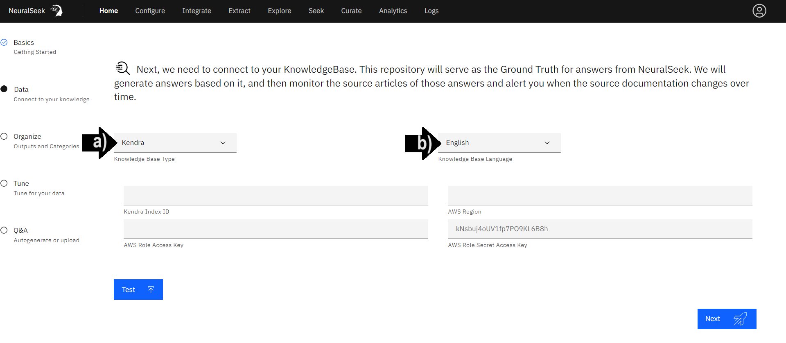
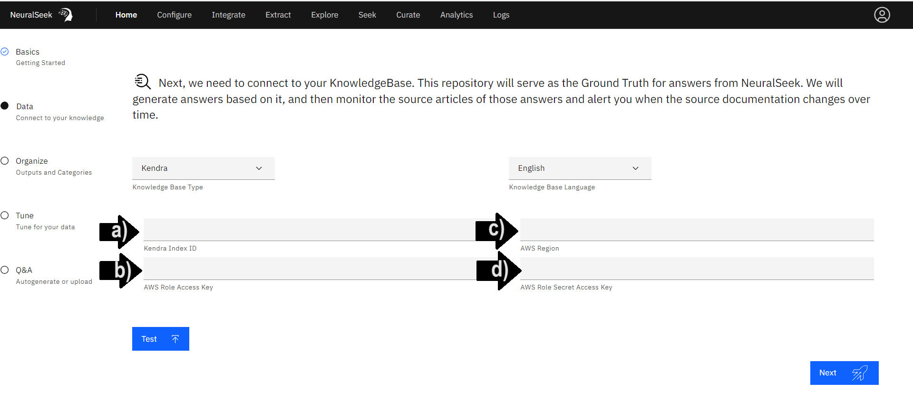
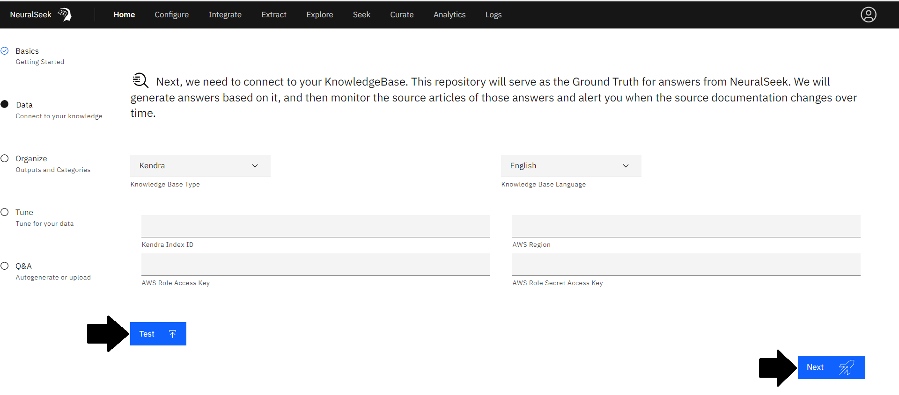
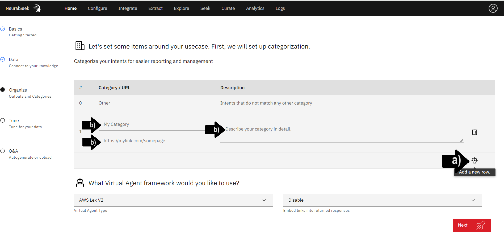
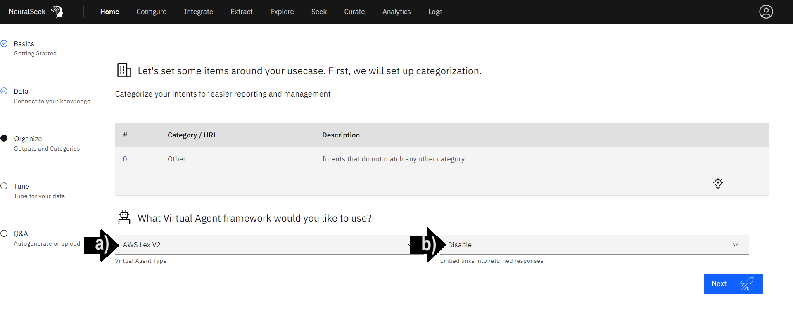
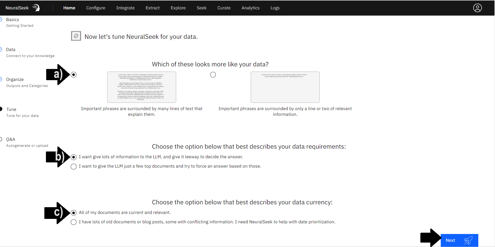

# Module 1.2 - Setup NeuralSeek

## Basics - Getting Started
First, we need a short writeup about your company or organization, focusing on the use-case for this instance of NeuralSeek.

- **(a)** Add a brief company or organization description. 
- **(b)** Select "Output Language" from the drop down menu. In this example, select "**English**". It's best to match the language of your KnowledgeBase and questions, but NeuralSeek is able to translate between many languages.
- **(c)** Select preferred use of NeuralSeek instance. Will this instance of NeuralSeek be used internally within your organization, or is it external - customer facing? We'll use this info to pre-tune some safety parameters for you. In this example, select "**Internal**". 

Click "Next" to save a unique description, language and use-case choice. 

## Data - Connect to your KnowledgeBase

- **(a)** Select desired KnowledgeBase from the drop down menu. For the purpose of this lab, we recommend the AWS KnowledgeBase "**Kendra**." 
- **(b)** Select desired language. For the purpose of this lab, click "**English**." 
  

### Add KnowledgeBase Information

User is responsible for providing selected KnowledgeBase details information. Since it takes time to set these up for yourself, we are going to be using the one that is already prepared for the learning lab, with read-only access. The actual values below will be provided during the course of this lab by the lab instructor.

> ⚠️ **To understand how to create and locate the AWS access keys, refer to this section: [AWS Access Keys]({{site.baseurl}}).**

Please enter the following:

- **(a)** Add "Kendra Index ID".
- **(b)** Add "AWS Role Access Key".
- **(c)** Add "AWS Region".
- **(d)** Add "AWS Role Secret Access Key".

 
Click the "Test" button to test the connection. Then, click "Next" to save KnowledgeBase configuration. 

> NeuralSeek is now set up with a KnowledgeBase, in this case: **Kendra Index**, and ready to seek. 

### ⚠️ For creating your own Kendra index to do the lab

With the interest of time, the lab will use an already built-in Kendra index that is pre-filled with the data. That is because of the fact that creating Kendra index and populating the data would take from 40 minutes to even over an hour to complete. However, in case you are interested to later perform the lab using your own Kendra index and keys, you can follow the below instruction.

🔗 <a href="">Setting up AWS Kendra Index and Access Keys</a>.

## Organize - Outputs and Categories
### Categorization
Categorize your intents for easier reporting and management. 

> If following the live lab, skip this step! 

- **(a)** Click the light bulb icon to add a new row. 
- **(b)** Enter in a unique category name, a corresponding URL, and a detailed description of the category with intents that do not match any other category.

### Virtual Agent Framework
- **(a)** Select "Virtual Agent Type" from the drop down menu. In this example, select "**AWS Lex V2**".
- **(b)** Select preferred choice of enabling or disabling embedding links into returned responses. In this example, select "**Disable**". 

Click "Next" to save reported categories andthe selected Virtual Agent framework. 

## Tune - Tune for your Data
Let's tune NeuralSeek for your data.

- **(a)** Select the preferred option for "Which of these looks more like your data?". For this example, select "**Important phrases are surrounded by many lines of text that explain them.**". 
    - The option "*Important phrases are surrounded by many lines of text that explain them*", describes data with more elaborate explanations with more extensive passages of text for a better understanding.  
    - The option "*Important phrases are surrounded by only a line or two of relevant information*", describes data with concise coverage of key phrases with just a line or two of necessary context. 
- **(b)** Select the preferred option that best describes your data requirements. For this example, select "**I want to give lots of information to the LLM, and give it leeway to decide the answer.**"
- **(c)** Select the preferred option that best describes your data currency. For this example, select "**All of my documents are current and relevant.**". 
    - The option "*All of my documents are current and relevant*", describes data that is up-to-date.
    - The option "*I have lots of old documents or blog posts, some with conflicting information. I need NeuralSeek to help with date prioritization*", describes data that may have conflicting or irrelevant details across different sources or documents.

Click "Next" to save reported tuning configurations. 

## Ready

NeuralSeek is ready to seek.

> NeuralSeek is now set up and ready to use. 