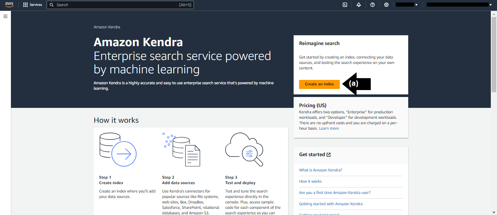
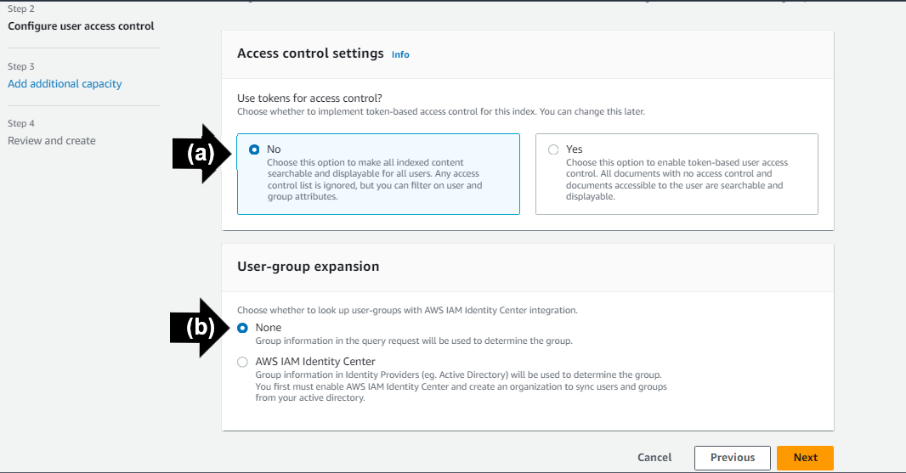
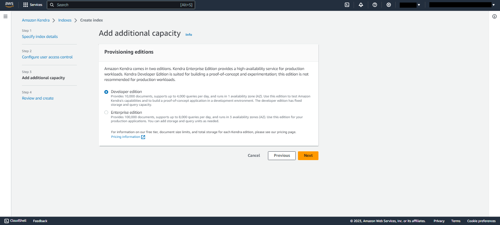
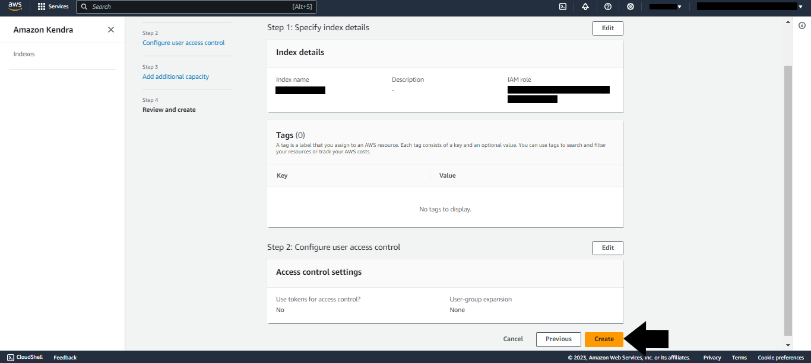
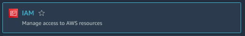
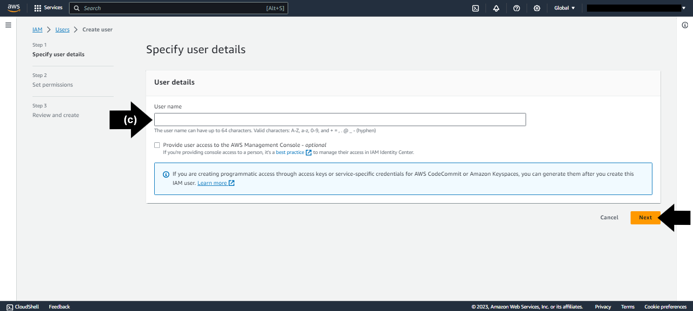
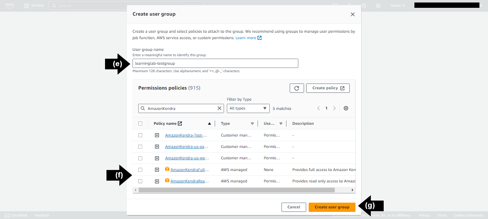
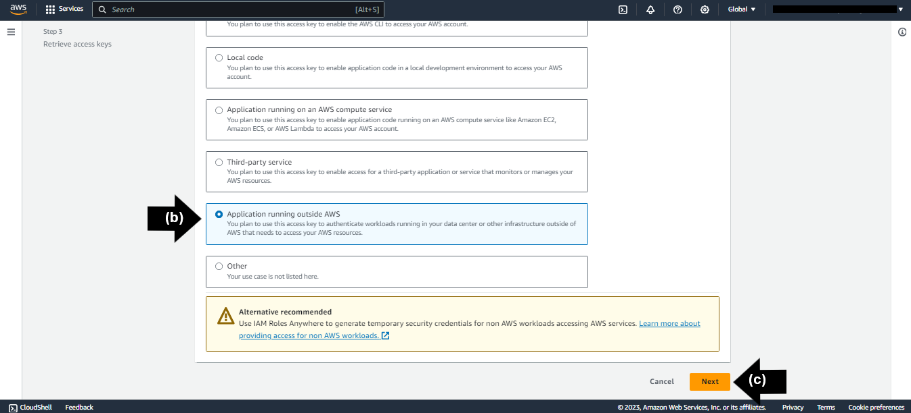

# AWS Access Keys Information

This section outlines how to generate the necessary access key information needed for establishing a successful connection between the AWS KnowledgeBase "Kendra Index" and NeuralSeek.

## Access Amazon Kendra

Navigate to "Amazon Kendra" on your AWS Console account.

- **(a)** Click "Create an Index."

## Specify Index Details 

Create a new index and IAM Role.

- **(a)** Add an Index name. In this example, "**learning-lab**".
- **(b)** Click "Create a New Role" under the IAM Role drop down menu.
- **(c)** Add a Role name. In this example, "**learning-lab**".  

Click "Next" to save new index and role. 

## Configure User Access Control

Set up a way to control who can see which documents by automatically filtering them according to each user ID and user groups.

- **(a)** Select option for "Access Control Settings". In this example, select "**No**".
- **(b)** Select option for "User-group expansion". In this example, select "**None**". 

Click "Next" to save user access control preferences. 

## Add Additional Capacity

Select desired option for "Provisioning Editions." In this example, select "**Developer edition**".

Click "Next" to save provisioning edition preference.

## Review and Create

Review the details on the page to ensure correctness.

Click "Create" to generate a new index and IAM role with specified access settings and provisioning edition. 

> ❕ Propagating IAM Role and creating the Index can take up to 30 minutes. 

## Kendra Index ID

Under the "Index Setting" section, copy the unqiue "**Index ID**" to use as the "Kendra Index ID" in the Corporate Knowledge Base Details section of NeuralSeek's Configure tab. 

## Create User

Navigate to IAM in the AWS Console.

- **(a)** Click "Users" on the left sidebar menu. 
- **(b)** Click "Create a User". 

- **(c)** Add a user name. For this example, "**learninglab-testgroup**". 

Click "Next". 

Click "Create Group."

- **(e)** Add a user group name. For this example, "**learninglab-testgroup**".
- **(f)** Select a policy name based on the best use case. For the purpose of this lab, select the "**AmazonKendraReadOnlyAccess**" policy name.
- **(g)** Click "Create user group", then click "Next."

Review the details, then click "Create User" to create the user. 

## Create Access Key

Navigate to the "Security Credentials" tab under the selected user after verfiying that the user is added to the correct group. 

- **(a)** In the "Access keys" section, click "Create access key."

- **(b)** Select the appropriate "Use case." For this example, select "**Application running outside AWS**".
- **(c)** Click "Next". 

Click "Create access key" to successfully create an access key.   

## AWS Role Access Keys

> ❕ *Disclaimer: the secret access key will be accessible only once. It is important to copy the secret access key prior to proceeding.*

On the "Retrieve access keys" page, copy the unqiue "**Access key**" to use as the "AWS Role Access Key" in the Corporate Knowledge Base Details section of NeuralSeek's Configure tab. 

On the same page, copy the unique "**Secret access key**" to use as the "AWS Role Secret Access Key" in the Corporate Knowledge Base Details section of NeuralSeek's Configure tab. 

Click "Done" to successfully add the essential AWS Access Key information into NeuralSeek when configuring to the AWS Kendra Index KnowledgeBase. 