# Module 1.3 - Integrate Virtual Agent with NeuralSeek

## Integrate 

Navigate to the “Integrate” tab in NeuralSeek.

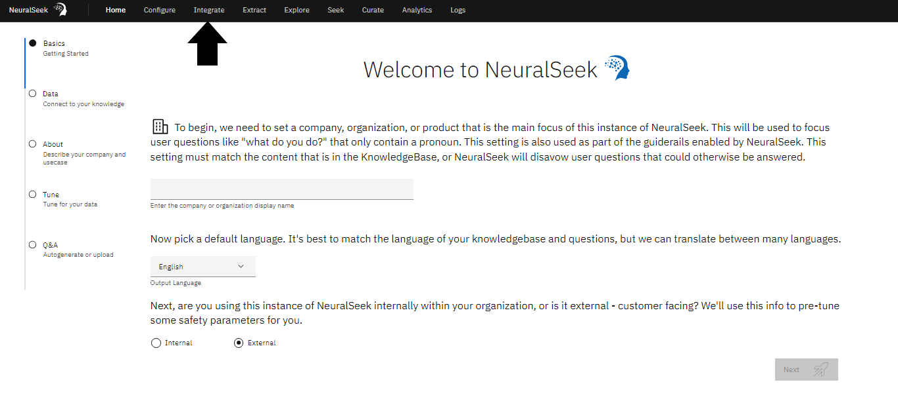

## Select Virtual Agent

Select the preferred choice of virtual agent on the left side menu.
For this lab, we recommend "**LexV2 Lambda**".


## Download File

Download the Lambda Archive .zip file to your local storage.

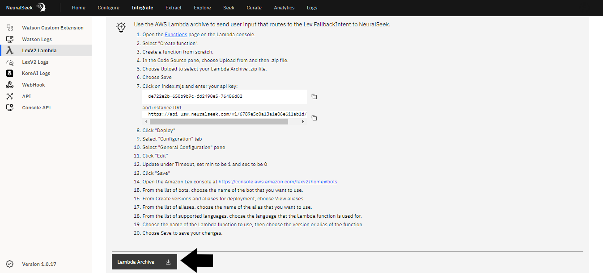

## Create a Function

Click the link to open the <a href="https://console.aws.amazon.com/lambda/home#/functions" target="_blank">Functions</a> page on the AWS Lambda console to create a function from scratch.
- **(a)** Select "Create Function".
- **(b)** Add a “Function Name”. For this lab, we recommend “learning-lab”.
- **(c)** Click “Create Function”.


## Upload the downloaded .zip File

Navigate to the Code Source pane in the AWS Lambda Function console. 
- **(a)** Click “Upload from”. Click “.zip file”.
- **(b)** Click “Upload” to select your Lambda Archive .zip file you downloaded.
- **(c)** Click “Save”.


## Add API Key and Instance URL

On the NeuralSeek "Integrate" page, copy the provided API key and Instance URL mentioned in the NeuralSeek's integration page.
Navigate to the Code Source pane in the AWS Lambda Function console. 
- **(a)** Click on the “index.mjs” file tab. 
- **(b)** Enter the copied API key and Instance URL into the code block:


```
const neuralSeekURL = “enter url here” ; 
const apikey = “enter api key here” ; 
```


- The "Deploy" button will enable. Click "Deploy" to successfully update and deploy the function.


## Update Timeout Setting

Navigate to the "Configuration" tab in AWS Lambda Function Console.

- **(a)** In the "General Configuration" pane, click "Edit".
- **(b)** Update under “Timeout”: set min to be “1” and sec to be “0”. This will ensure the lambda function will not time out for 1 minute.
- **(c)** Click "Save".

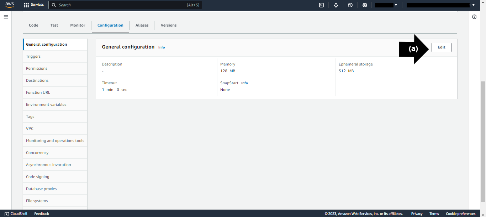

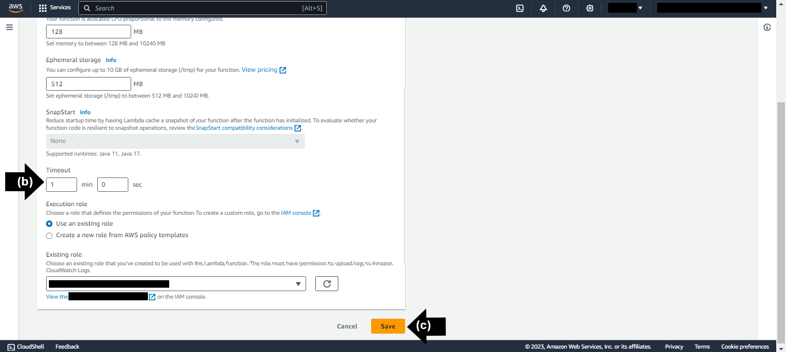

<!--- For detailed information on creating a LexV2 Lambda bot from scratch, refer to the documentation [here.]({{site.baseurl}}) ---> 

## Create a Lex Bot

1. Open the <a href="https://console.aws.amazon.com/lexv2/home#bots" target="_blank">Amazon Lex console</a>. click "Create bot" under the Bots section.
2. In the creation method, select "Create a blank bot".
3. Name the bot "TestBot".
4. Select "Create a role with basic Amazon Lex permissions" in IAM Permissions.
5. Select "No" in Children's Online Privacy Protection Act (COPPA).
6. Click "Next".
7. Click "Done".
8. In the `Sample utterances` section, add an utterance. It can be anything (e.g. Hello).
9. In the `Initial response` section, add any response that may be suitable. (e.g. Welcome to the test bot).
8. Click "Save intent" to save a default intent without adding anything.

## Selecting Alias

Open the <a href="https://console.aws.amazon.com/lexv2/home#bots" target="_blank">Amazon Lex console</a>. Select the "TestBot" from the list of the Bots.
- **(a)** On the left side bar menu, under “Deployment”, click “Aliases”.
- **(b)** From the list of alias names, choose the alias name that you want to use. Select "**TestBotAlias**".


## Select Language

Under the chosen Alias, "**TestBotAlias**" within the <a href="https://console.aws.amazon.com/lexv2/home#bots" target="_blank">Amazon Lex console</a>:

- **(a)** From the list of supported languages, click the language that the Lambda function is used for. For this lab, we recommend “**English**”.

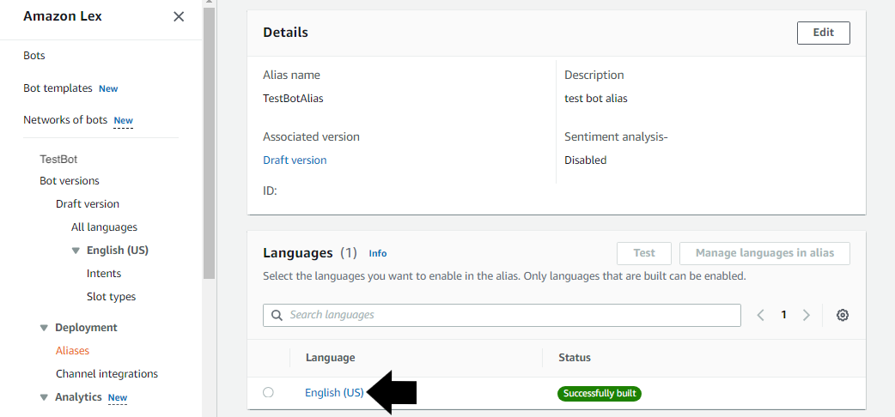

## Optional Lambda Function Connection

- **(a)** Under "Source", click the name of the alias of the Lambda function to use. For this lab, we recommend "**learning-lab**”. 
- **(b)** Under "Lambda function version or alias", the option "**$LATEST**" will populate. 
- **(c)** Click “Save”.

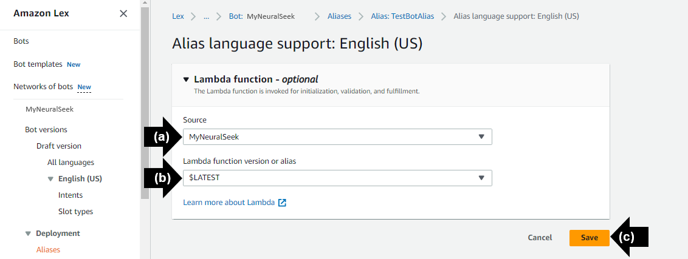

## Fallback Activities

The default FallbackIntent allows for the Lambda function to be called when it is detected. The idea is that Lex would invoke NeuralSeek to answer whenever there is no matching intent found. To activate this, navigate to <a href="https://console.aws.amazon.com/lexv2/home#bots" target="_blank">Amazon Lex console</a>.

- **(a)** Click “TestBot”
- **(b)** Click “Intents” under “English (US)” on the left sidebar menu.
- **(c)** Click on the “FallbackIntent” link.

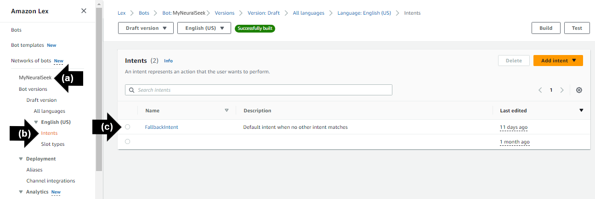

Under the "Fulfillment" section, click the "Activate" icon to turn on. 

- **(a)** Click "Advanced Options"
- **(b)** Select the “Use a Lambda Function for Fulfillment” option. 
- **(c)** Click "Update Options."
- Click "Save Intent."

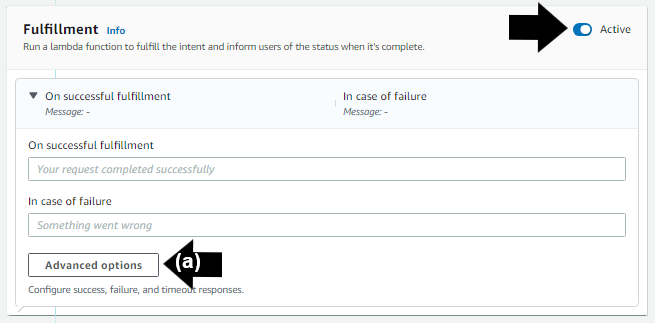

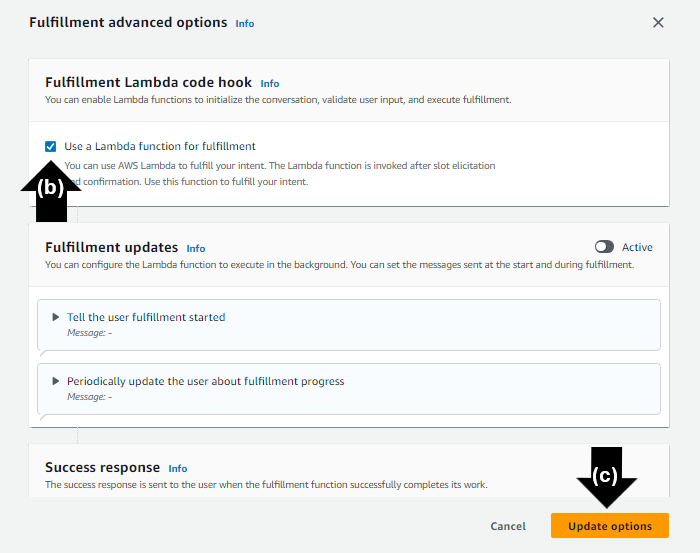

Build the chatbot and test the FallbackIntent routine with a question. 

- **(a)** Click “Build.” This step may take a few moments.
- **(b)** Click “Test.” The Amazon Lex chatbot will be generated. 
- Prompt the chatbot with a question. For the purpose of this lab, we used “**What is NeuralSeek?**”
- Notice the answer and the detailed information about the answer is returned to the chat bot.

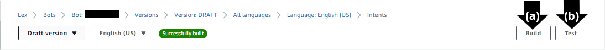

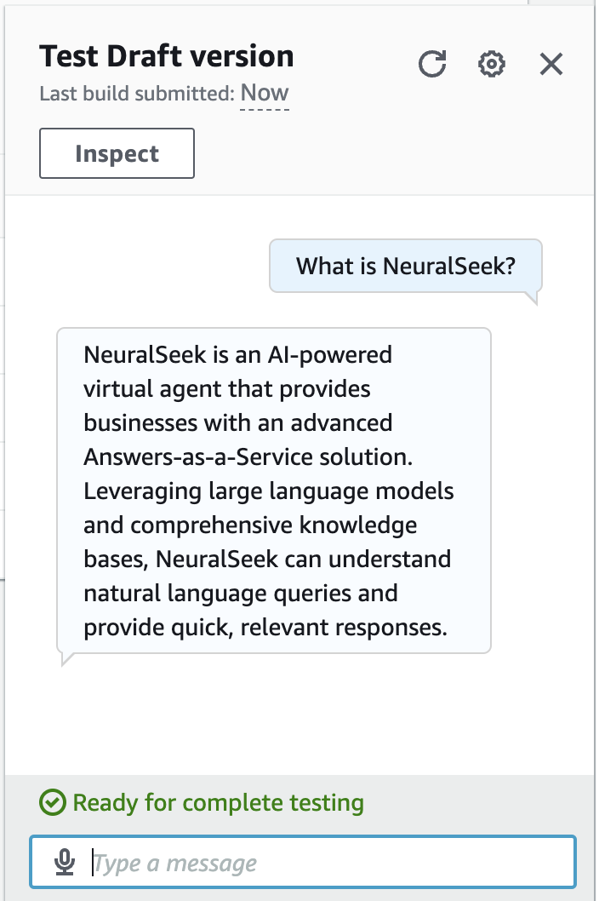

> The **AWS LexV2 Lambda** Virtual Agent is now set up, integrated with NeuralSeek, tested and ready for use. 