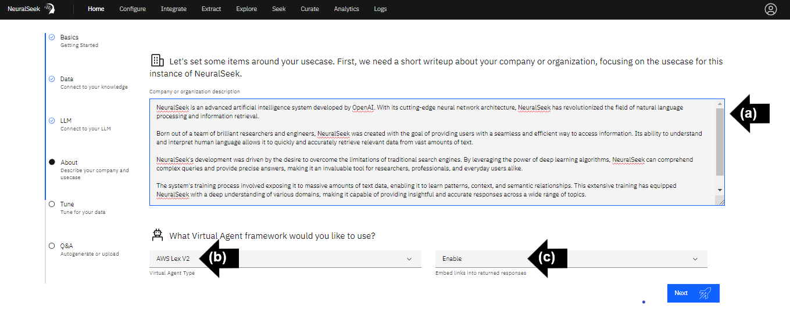
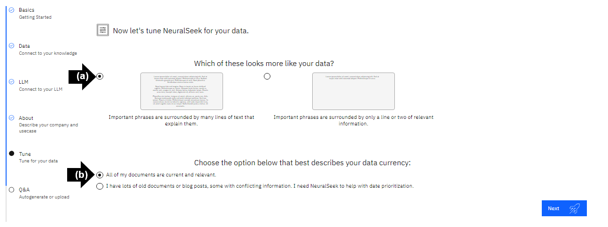
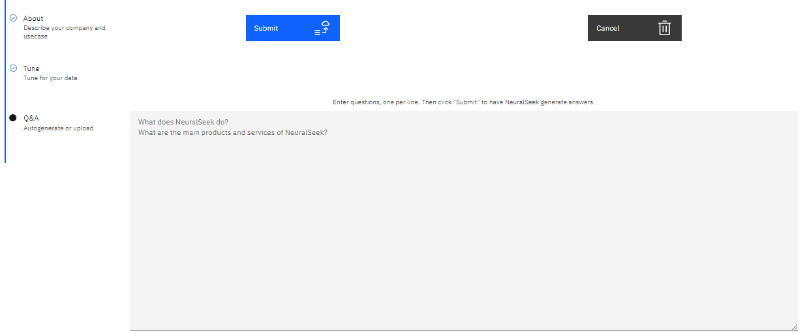
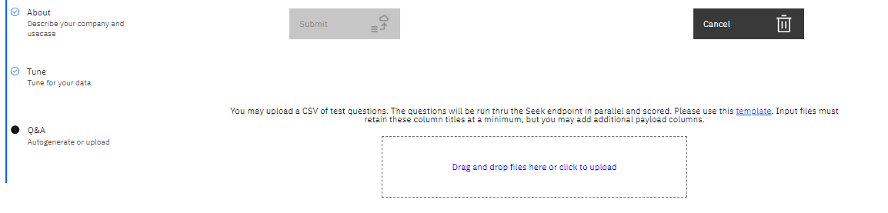

# About, Tune, Q&A

## About

Let's set some items around your usecase. First, we need a short writeup about your company or organization, focusing on the usecase for this instance of NeuralSeek.

- **(a)** Add a brief company or organization description. 
- **(b)** Select "Virtual Agent Type" from the drop down menu. In this example, select "**AWS Lex V2**".
- **(c)** Select preferred choice of enabling or disabling embedding links into returned responses. In this example, select "**Enable**". 

Click "Next" to save unique description and virtual agent framework choice. 

## Tune

Let's tune NeuralSeek for your data.

- **(a)** Select preferred option for "Which of these looks more like your data?". For this example, select "**Important phrases are surrounded by many lines of text that explain them.**". 
    - The option "*Important phrases are surrounded by many lines of text that explain them*", describes data with more elaborate explanations with more extensive passages of text for a better understanding.  
    - The option "*Important phrases are surrounded by only a line or two of relevant information*", describes data with concise coverage of key phrases with just a line or two of necessary context. 
- **(b)** Select preferred option that best describes your data currency. For this example, select "**All of my documents are current and relevant.**". 
    - The option "*All of my documents are current and relevant*", describes data that is up-to-date.
    - The option "*I have lots of old documents or blog posts, some with conflicting information. I need NeuralSeek to help with date prioritization*", describes data that may have there are conflicting or irrelevant details across different sources or documents.

Click "Next" to save unique tuning options for your data.

## Q&A

As questions are answered by NeuralSeek, we can automatically build out and maintain portions your Virtual Agent.

Use the buttons below to quickly generate Q&A content to bootstrap and test your Virtual Agent.

 

- **Auto-Generate Questions** will query the knowledgebase, ask NeuralSeekm generate insights and output a variety of test questions based on your corporate content. Click "Submit" to have NeuralSeek generate answers. 

 

- **Manually Input Questions** will provide a blank test box for you to enter questions, one per line, based on your corporate content. Click "Submit" to have NeuralSeek generate answers. 

- **Upload Test Questions** will provide a link to your local file explorer to upload a CSV file of test questions. The questions will be run thru the Seek endpoint in parallel and scored. Please use the provided downloadable .csv file as a template for your questions.  Input files must retain these column titles at a minimum, but you may add additional payload columns. Click "Submit" to have NeuralSeek generate answers. 

> NeuralSeek is now ready to answer!