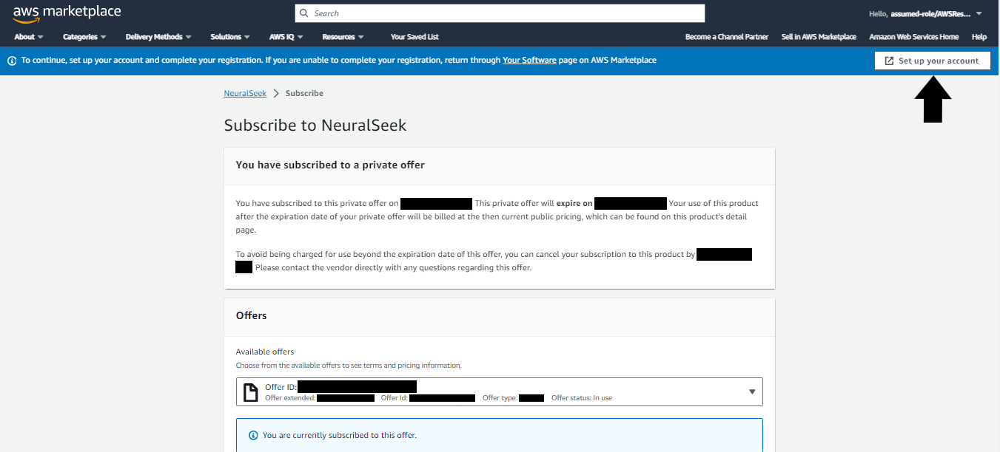
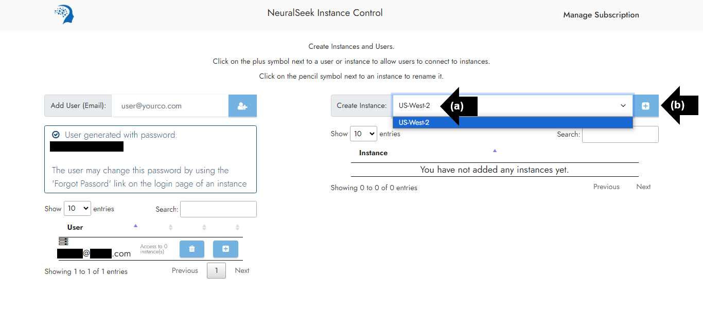
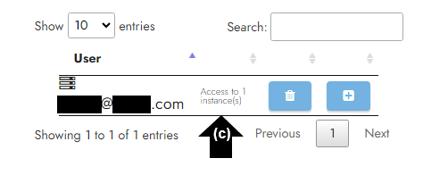

# Module 1.1 - Launch NeuralSeek

## Log in

Log in to the [AWS Console Marketplace page.](console.aws.amazon.com/marketplace/home)

## Manage Subscriptions

On the left side bar menu, click “Manage Subscriptions."

## Add NeuralSeek

Navigate to "NeuralSeek by Cerebral Blue" subscription.

## Set up Product

Click “Set up Product” in the bottom right corner

## Set up Account

Click “Set up your account” in the top right corner.

## User Interface 

User Interface for AWS broker page will automatically display.

## Create a User

You will need to have a viable user to be able to connect to instances.

- **(a)** Enter email address into “Add User (Email)” box. 
- **(b)** Click on the "plus" icon to add a user.

## Generate Password

- **(a)** Newly created user’s email will populate below.
- **(b)** A new password will be generated. Passwords can be changed later, refer [here](module1_aws/module1-3.md).

## Create an Instance

Generating an instance at this stage will not initiate any server activity. Creating an instance merely establishes a unique identifier within the database, enabling authentication and access to the system.

- **(a)** Select desired location in the “Create Instance” box. For this lab, we recommend “US-West-2.”
- **(b)** Click the “plus” icon to create an instance.
  

## Update Instance Name

The newly created instance will populate below and an instance ID will be generated.

- **(a)** Click the “writing tool” icon.
- **(b)** Enter desired instance name into text box. For the purpose of this lab, we recommend “learning-lab-test”. 
- **(c)** Click the “writing tool” icon to save changes. 
- **(d)** Updated instance name will populate. 
  

## Connect

To allow the user to connect to the instance:

- **(a)** Click ‘Configure User Access to Instances’ “plus” icon.
- **(b)** Click the “plus” icon.
- **(c)** User is now able to connect to the instance.
  

## Instance Link

Click on the instance link in the user interface.

## Log In

Fill out the necessary information below to log in to NeuralSeek.

- **(a)** Enter user email address.
- **(b)** Enter user password generated from the "Create a User" section in [Module 1.2]({{site.baseurl}}). 

If desired, you are able to reset the password using the “Forgot password?” link.

## Continue

Click "Continue" to be directed to the NeuralSeek user interface page. 

> An active user and instance of NeuralSeek is now set up within the AWS console and ready to be connected to a KnowledgeBase.