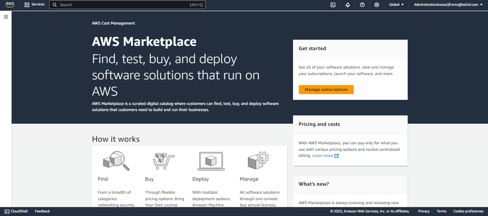

# Module 1.1 - Launch NeuralSeek

## Log in

Log in to [AWS Marketplace.](https://aws.amazon.com/marketplace)

## Manage Subscriptions

On the left side bar menu, click “Manage Subscriptions."

## Add NeuralSeek

Navigate to "NeuralSeek by Cerebral Blue" subscription.

## Set up Product

Click “Set up Product” in the bottom right corner

## Set up Account

Click “Set up your account” in the top right corner.

## User Interface 

User Interface for AWS broker page will automatically display.

