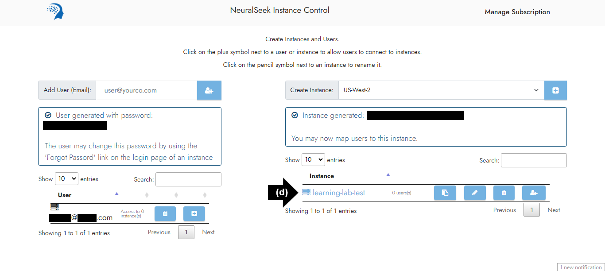

# Module 1.2 - NeuralSeek Instance Control

## Create a User

You will need to have a viable user to be able to connect to instances.

- **(a)** Enter email address into “Add User (Email)” box. 
- **(b)** Click on the "plus" symbol to add a user.

## Generate Password

- **(a)** Newly created user’s email will populate below.
- **(b)** A new password will be generated. Passwords can be changed later, refer [here](module1_aws/module1-3.md).

## Create an Instance

Generating an instance at this stage will not initiate any server activity. Creating an instance merely establishes a unique identifier within the database, enabling authentication and access to the system.

- **(a)** Select desired location in the “Create Instance” box. For this lab, we recommend “US-West-2.”
- **(b)** Click the “plus” symbol to create an instance.
  

## Update Instance Name

The newly created instance will populate below and an instance ID will be generated.

- **(a)** Click the “writing tool” symbol.
- **(b)** Enter desired instance name into text box. For the purpose of this lab, we recommend “learning-lab-test”. 
- **(c)** Click the “writing tool” symbol to save changes. 
- **(d)** Updated instance name will populate. 
  

## Connect

To allow the user to connect to the instance:

- **(a)** Click ‘Configure User Access to Instances’ “plus” symbol.
- **(b)** Click the “plus” symbol.
- **(c)** User is now able to connect to the instance.
  

