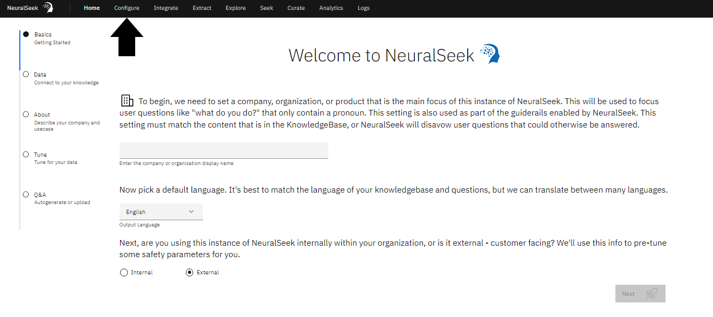
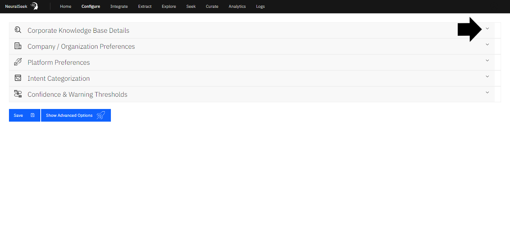

# Module 1.4 - Configure KnowledgeBase with NeuralSeek

## Configure.
Navigate to the “Configure” tab in NeuralSeek.

## Corporate KnowledgeBase Details. 
Click the “Corporate KnowledgeBase Details” drop down menu. 

## Select KnowledgeBase. 
Select desired KnowledgeBase from the drop down menu. 
- We recommend the AWS KnowledgeBase "**Kendra Index**" option. For the purposes of this lab, we will be using "**AWS OpenSearch**".
  
## Add KnowledgeBase Information. 
User is responsible for providing selected KnowledgeBase detail information. 
For the purposes of this lab:
- **(a)** Add KB Endpoint.
- **(b)** Add username.
- **(c)** Add password.
- **(d)** Add Index Name.
  
## Change Advanced Schema Options. 
Click “Enable Schema Options.”
- **(a)** Change “Curation Data Field” to message. 
- **(b)** Change “Link Field” to URL.
- **(d)** Change “Document Name Field” to request.
- **(e)** Click “Enable Advanced Schema.”
