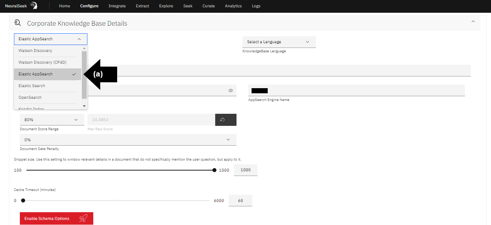
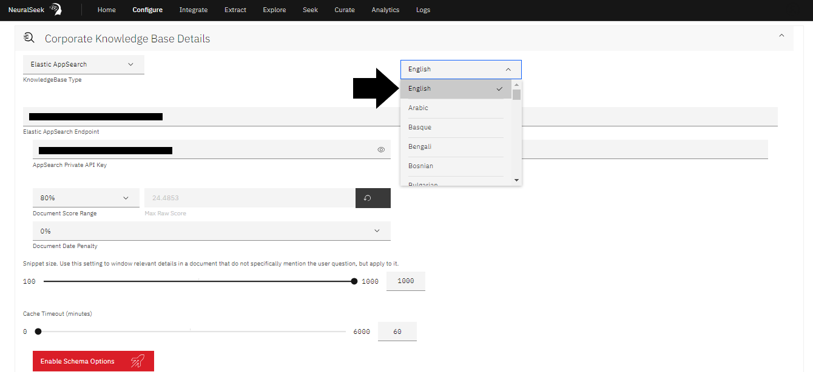
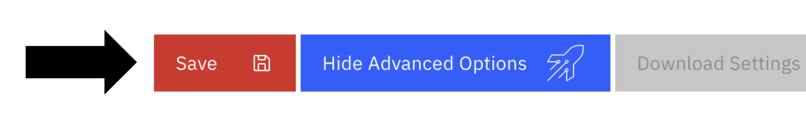

# Module 1.4 - Configure KnowledgeBase with NeuralSeek

## Configure

Navigate to the “Configure” tab in NeuralSeek.

## Corporate KnowledgeBase Details

Click the “Corporate KnowledgeBase Details” drop down menu. 

## Select KnowledgeBase

- **(a)** Select desired KnowledgeBase from the drop down menu. For the purpose of this lab, we recommend "**Elastic AppSearch**." 
- **(b)** Select desired language. For the purpose of this lab, click "English." 
  

## Add KnowledgeBase Information

User is responsible for providing selected KnowledgeBase detail information. Since it takes time to set these up for yourself, we are going to be using the one that is already prepared for the learning lab, with read-only access. The actual values below will be provided during the course of this lab by the lab instructor.

Please enter the following:

- **(a)** Add "Elastic AppSearch Endpoint".
- **(b)** Add "AppSearch Private API Key".
- **(c)** Add "AppSearch Engine Name".

 
Click "Save" button at the bottom.

