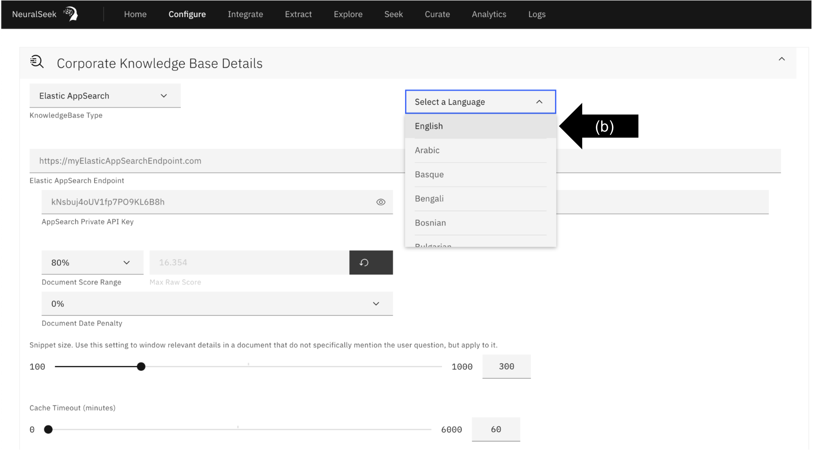
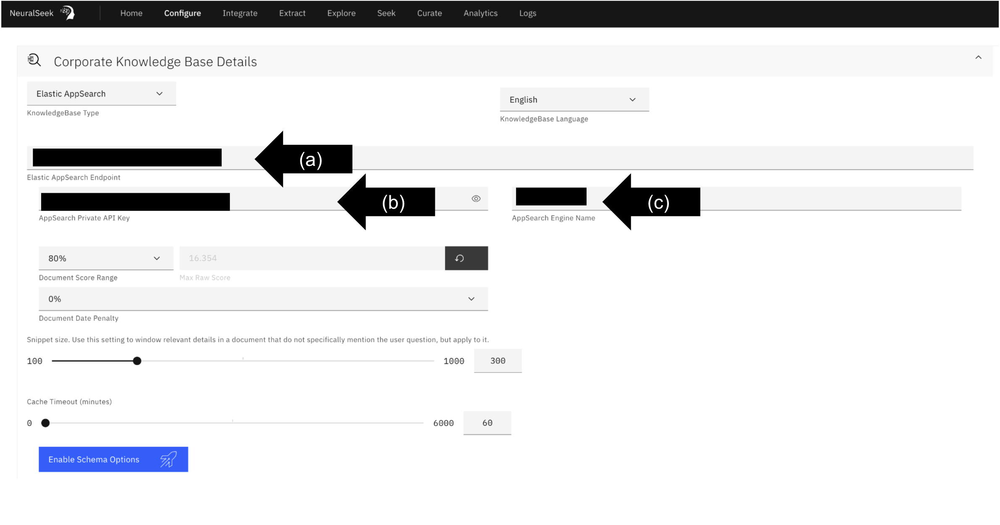

# Module 1.4 - Configure KnowledgeBase with NeuralSeek

## Configure.
Navigate to the “Configure” tab in NeuralSeek.

## Corporate KnowledgeBase Details. 
Click the “Corporate KnowledgeBase Details” drop down menu. 

## Select KnowledgeBase. 
- **(a)** Select desired KnowledgeBase from the drop down menu. For the purpose of this lab, we recommend the AWS KnowledgeBase "**Kendra Index**." 
- **(b)** Select desired language. For the purpose of this lab, click "English." 
  

## Add KnowledgeBase Information. 
User is responsible for providing selected KnowledgeBase detail information. To see AWS access keys, refer [here]({{site.baseurl}}) 

For the purposes of this lab:
- **(a)** Add "Kendra Index ID".
- **(b)** Add "AWS Role Access Key".
- **(c)** Add "AWS Region".
- **(d)** Add "AWS Role Secret Access Key".

  
## Change Advanced Schema Options. 
Click “Enable Schema Options.”
- **(a)** Change “Link Field” to URL.
- **(b)** Change “Document Name Field” to request.
- **(c)** Click “Enable Advanced Schema.”
