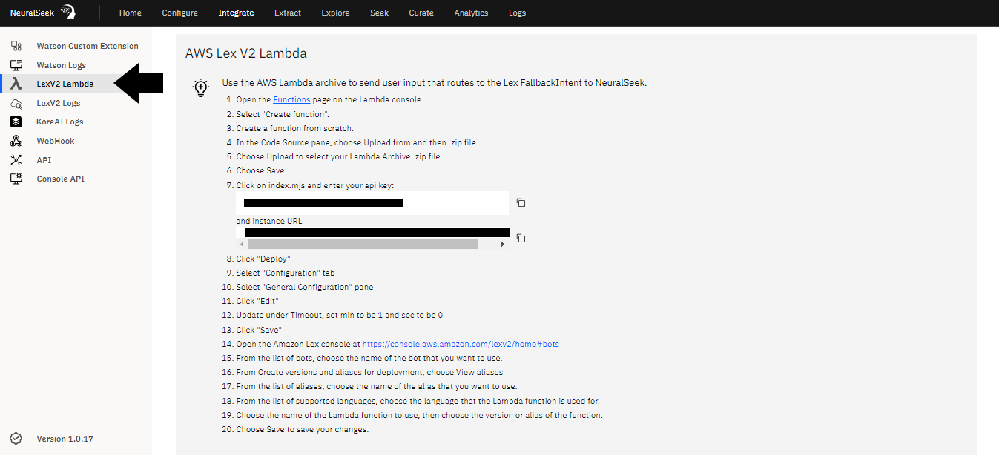
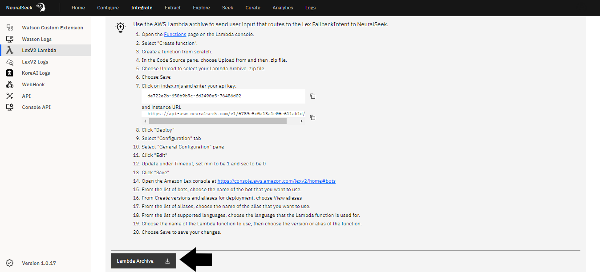
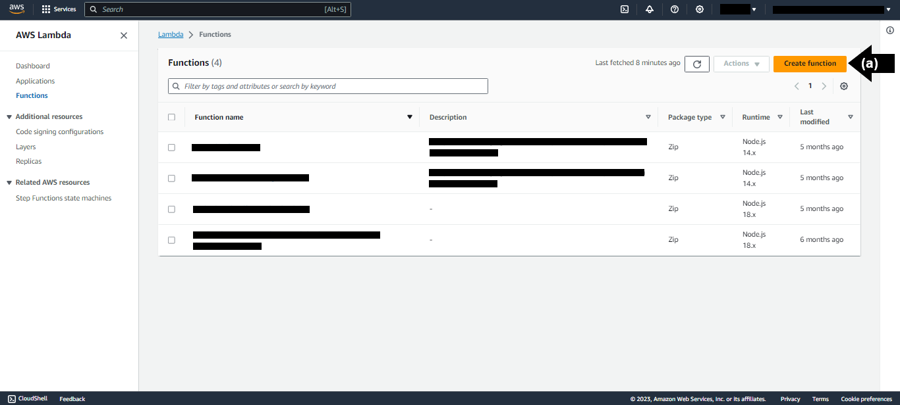
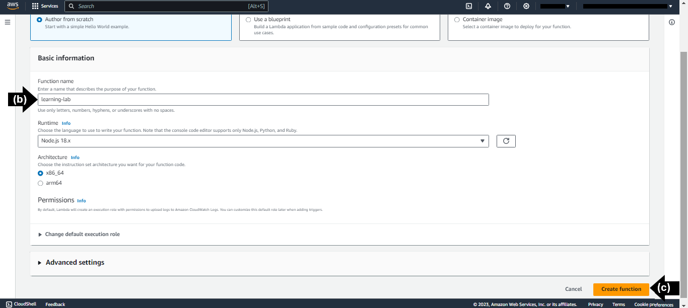
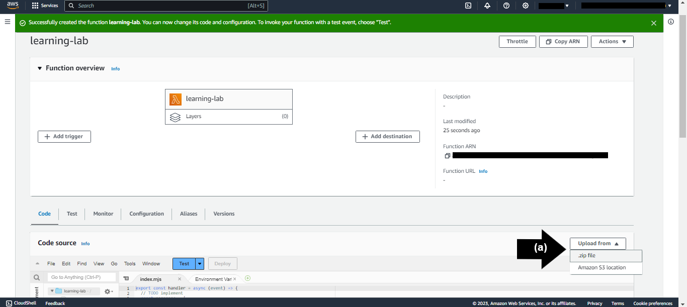
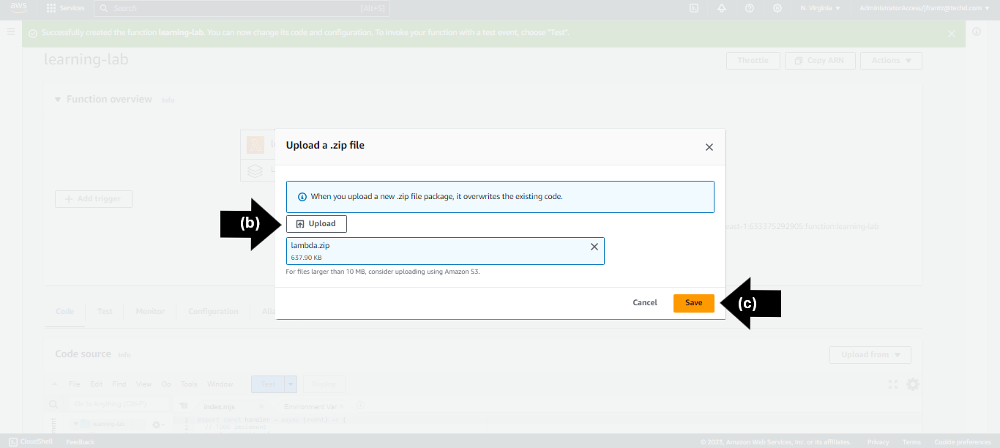
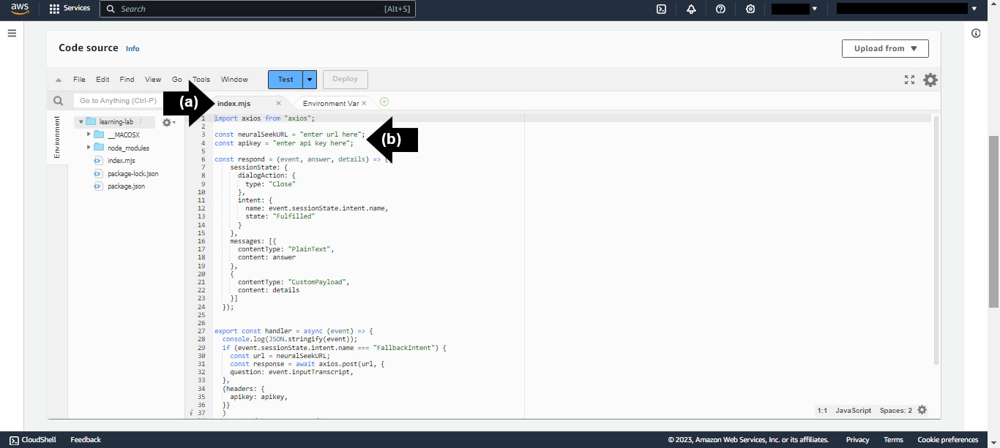
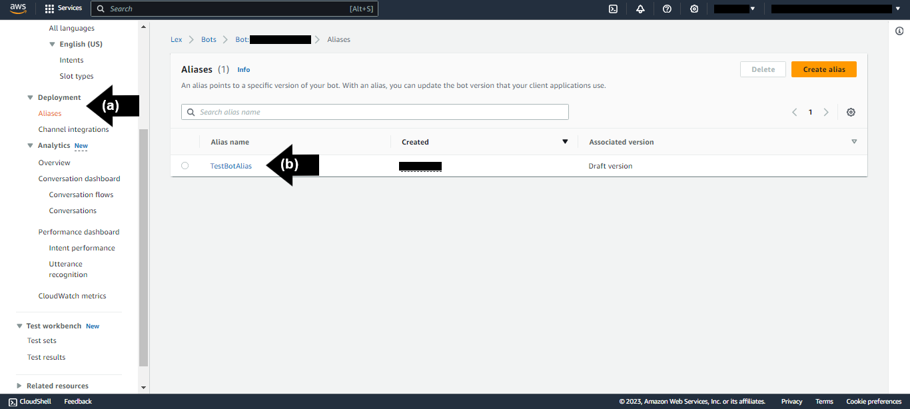

# Module 1.5 - Integrate Virtual Agent with NeuralSeek

## Integrate 
Navigate to the “Integrate” tab in NeuralSeek.


## Select Virtual Agent
Select choice of virtual agent on left side menu.
For this lab, we recommend "**LexV2 Lambda**".



## Download File
Download the Lambda Archive .zip file.



## Create a Function
Click the link to open the Functions page on the AWS Lambda console to create a function from scratch.
- **(a)** Select "Create Function".
- **(b)** Add a “Function Name”. For this lab, we recommend “learning-lab”.
- **(c)** Click “Create Function”.





## Upload File
Navigate to the Code Source pane in the AWS Lambda Function console. 
- **(a)** Click “Upload from”. Click “.zip file”.
- **(b)** Click “Upload” to select your Lambda Archive .zip file.
- **(c)** Click “Save”.





## Add API Key and Instance URL
On the NeuralSeek "Integrate" page, copy the provided API key and Instance URL.
Navigate to the Code Source pane in the AWS Lambda Function console. 
- **(a)** Click on the “index.mjs” file tab. 
- **(b)** Enter the copied API key and Instance URL into the code block:

```
const neuralSeekURL = “enter url here” ; 
const apikey = “enter api key here” ; 
```

- The "Deploy" button will enable. Click "Deploy" to succesfully update the function.



## Update Timeout Setting
Navigate to "Configuration" tab in AWS Lambda Function Console.
- **(a)** In the "General Configuration" pane, click "Edit".
- **(b)** Update under “Timeout”: set min to be “1” and sec to be “0”.
- **(c)** Click "Save".


For detailed information on creating a LexV2 Lambda bot from scratch, refer to the documentation [here.]({{site.baseurl}}) 

## Assign Alias 
Open the [Amazon Lex console.](https://console.aws.amazon.com/lexv2/home#bots) From the list of bots, choose the name of the bot that you want to use.
- **(a)** On the left side bar menu, under “Deployment”, click “Aliases”.
- **(b)** From the list of alias names, choose the alias name that you want to use. For this lab, we recommend “TestBotAlias”



## Select Lanaguage
Open the [Amazon Lex console.](https://console.aws.amazon.com/lexv2/home#bots) From the list of bots, choose the name of the bot that you want to use. 
- **(a)** On the left side bar menu, click the “Languages” tab.
From the list of supported languages, click the language that the Lambda function is used for. For this lab, we recommend “English”.

## Optional Lambda Function Connection
Choose the name of the Lambda function to use, then choose the version or alias of the function. For this lab, we recommend “MyNeuralSeek”. Then, click “Save”.

## Fallback Activities
The default FallbackIntent allows for the Lambda function to be called when it is detected. To activate this intent, navigate to Amazon Lex in AWS Console
- **(a)** Click “MyNeuralSeek.”
- **(b)** Click “Intents” under “English (US)” on the left sidebar menu.
- **(c)** Click on the “FallbackIntent” link.

Under the "Fullfillment" section, click the "Activate" icon to turn on. 
- **(a)** Click "Advanced Options"
- **(b)** Select the “Use a Lambda Function for Fulfillment” option. 
- **(c)** Click "Update Options."
- **(d)** Click "Save Intent."

Build the chatbot and test the FallbackIntent routine with a question. For the purpose of this lab, we used "Why is the sky blue?". 
- **(a)** Click “Build.” This step may take a few moments.
- **(b)** Click “Test.” The Amazon Lex chatbot will be generated. 
- **(c)** Prompt the chatbot with a question. For the purpose of this lab, we used “Why is the sky blue?.”
