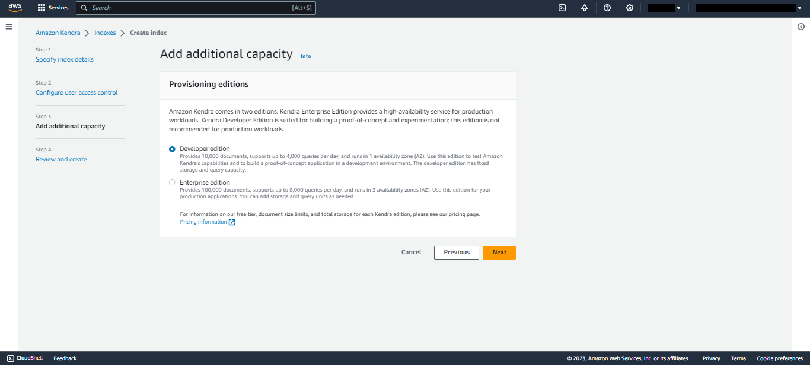

## Disclaimer

Before participating in this Learning Lab, it is essential that users come prepared with the necessary resources to fully engage in the practical exercises. We recommend having an active instance of an:

- **Large Language Model (LLM)**, we recommend the Amazon Bedrock LLM "**Claude 2**"
- **KnowledgeBase**, we recommend the AWS KnowledgeBase "**Kendra Index**"
- **Virtual Agent**, we recommend the AWS Virtual Agent "**LexV2 Lambda**".
- Active NeuralSeek subscription

Please be aware that any purchases or subscriptions related to the aforementioned tools must be made independently by the users. Additionally, to access NeuralSeek functionalities within the lab, users are required to have an active subscription to NeuralSeek on the AWS Marketplace. It is the responsibility of each participant to understand and manage the associated costs related to the use of NeuralSeek and any other integrated services within their AWS environment. Kindly ensure that all necessary resources are set up and accessible prior to beginning the Learning Lab for a seamless and enriching experience.

## AWS Access Keys
### Access Amazon Kendra
Navigate to "Amazon Kendra" on AWS Console account.
- **(a)** Click "Create an Index."

### Specify Index Details 
- **(a)** Add an "Index name."
- **(b)** Click "Create a New Role" under IAM Role drop down menu.
- **(c)** Add a "Role name." 
- **(d)** Click "Next." 

### Configure User Access Control
Select desired options for "Access Control Settings" and "User-group expansion." Then click "Next."

### Add Additional Capacity
Select desired option for "Provisioning Editions." Then. click "Next."

### Review and Create
Review the details on the page, then click "Create". Propagating IAM Role and creating the Index can take up to 30 minutes. 

### ID's and Keys
Under "Index Setting" section, copy the unqiue "Index ID" to use as the "Kendra Index ID" in the Corporate Knowledge Base Details section of NeuralSeek's Configure tab. 

Click the top right drop down menu. Select "Security Credentials". 

create a user 
set it to a group
assign permissions to the group
create an access key for the user

