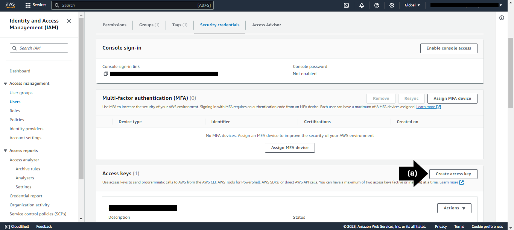

## Disclaimer

Before participating in this Learning Lab, it is essential that users come prepared with the necessary resources to fully engage in the practical exercises. We recommend having an active instance of an:

- **Large Language Model (LLM)**, we recommend the Amazon Bedrock LLM "**Claude 2**"
- **KnowledgeBase**, we recommend the AWS KnowledgeBase "**Kendra Index**"
- **Virtual Agent**, we recommend the AWS Virtual Agent "**LexV2 Lambda**".
- Active NeuralSeek subscription

Please be aware that any purchases or subscriptions related to the aforementioned tools must be made independently by the users. Additionally, to access NeuralSeek functionalities within the lab, users are required to have an active subscription to NeuralSeek on the AWS Marketplace. It is the responsibility of each participant to understand and manage the associated costs related to the use of NeuralSeek and any other integrated services within their AWS environment. Kindly ensure that all necessary resources are set up and accessible prior to beginning the Learning Lab for a seamless and enriching experience.

## AWS Access Keys
### Access Amazon Kendra
Navigate to "Amazon Kendra" on AWS Console account.
- **(a)** Click "Create an Index."

### Specify Index Details 
- **(a)** Add an "Index name."
- **(b)** Click "Create a New Role" under IAM Role drop down menu.
- **(c)** Add a "Role name." 
- **(d)** Click "Next." 

### Configure User Access Control
Select desired options for "Access Control Settings" and "User-group expansion." Then click "Next."

### Add Additional Capacity
Select desired option for "Provisioning Editions." Then. click "Next."

### Review and Create
Review the details on the page, then click "Create". Propagating IAM Role and creating the Index can take up to 30 minutes. 

### Kendra Index ID
Under "Index Setting" section, copy the unqiue "Index ID" to use as the "Kendra Index ID" in the Corporate Knowledge Base Details section of NeuralSeek's Configure tab. 

### Create User
Navigate to IAM in the AWS Console.

- **(a)** Click "Users" on the left sidebar menu. 
- **(b)** Click "Create a User". 

- **(c)** Add a user name, then click "Next."

- **(d)** Click "Create Group."
- **(e)** Add a user group name, then select a policy name based on the best use case. For the purpose of this lab, select the "AmazonKendraReadOnlyAccess" policy name.
- **(f)** Click "Create user group", then click "Next."

- **(g)** Review the details, then click "Create User" to create the user. 

### Create Access Key
Navigate to the "Security Credentials" tab under the selected user after verfiying that the user is added to the correct group. 
- **(a)** In the "Access keys" section, click "Create access key."

- **(b)** Select the appropriate "Use case." For the purpose of this lab, select "Application running outside AWS".
- **(c)** Click "Next". 
- **(d)** Click "Create access key." 

### AWS Role Access Keys
On the "Retrieve access keys" page, copy the unqiue "Access key" to use as the "AWS Role Access Key" in the Corporate Knowledge Base Details section of NeuralSeek's Configure tab. 

On the same page, copy the unique "Secret access key" to use as the "AWS Role Secret Access Key" in the Corporate Knowledge Base Details section of NeuralSeek's Configure tab. 

***Disclaimer: the secret access key will be accessible only once. It is important to copy the secret access key prior to proceeding.***

- **(a)** Click "Done."
