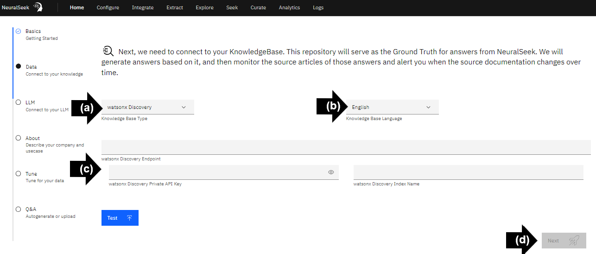
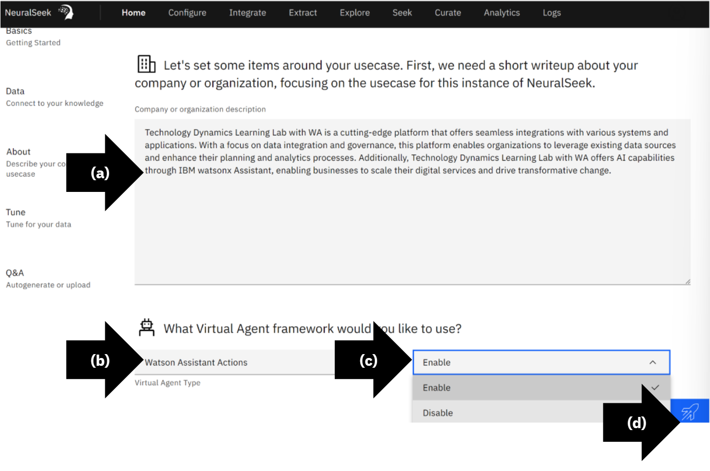
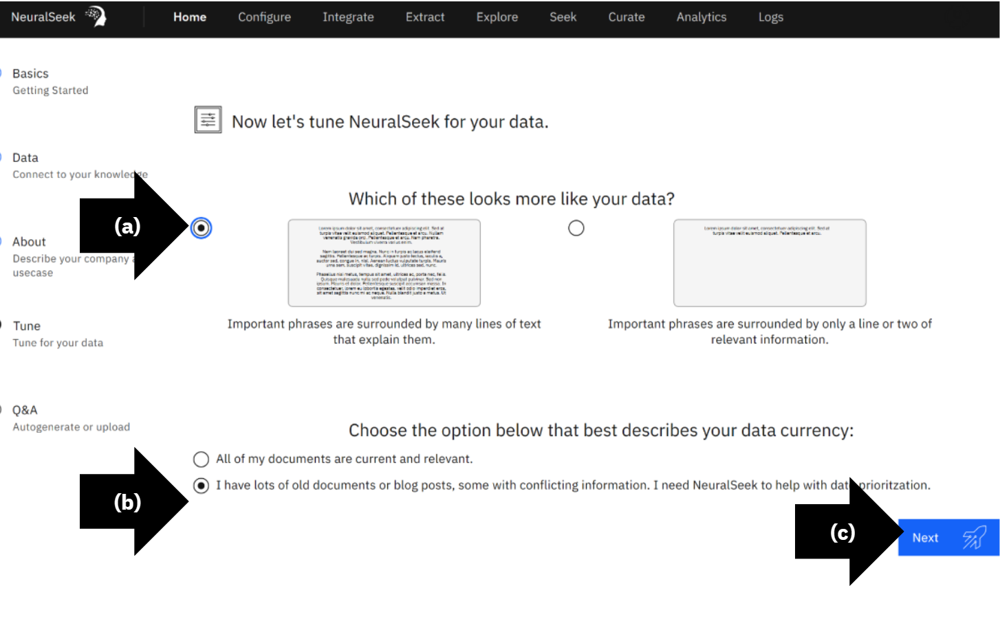
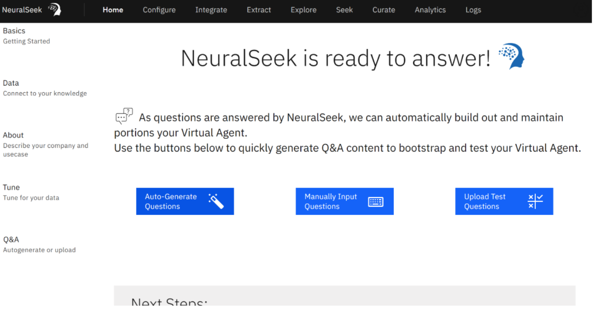

# Module 1.1 - Launch NeuralSeek

## Add NeuralSeek

Log in to [IBM Cloud](https://cloud.ibm.com/login?cm_sp=ibmdev-_-developer-_-trial&_gl=1*1odtrhw*_ga*NTM2NzU0MTk0LjE2OTY1MjE4NDQ.*_ga_FYECCCS21D*MTY5Njg2NzU0Ni41LjEuMTY5Njg2ODg5OS4wLjAuMA..). Search and select [NeuralSeek](https://cloud.ibm.com/catalog/services/neuralseek?cm_sp=ibmdev-_-developer-_-trial) from Catalog. 
- **(a)** Select a plan type. 
- **(b)** To agree to the third-party terms, in the bottom right, open and read the terms then check, “I have read and agree to the following third-party terms”. 
- **(c)** To provision, click “Create”.

## Launch NeuralSeek

Click “Launch NeuralSeek”.

## Basic Information

Complete required form. 
- **(a)** Enter the company name or organization display name.
- **(b)** Select output language. For the purpose of this lab we recommend English. 
- **(c)** Start training NeuralSeek AI by checking the purpose of the virtual agent. Choose “Internal” or “External”.
- **(d)** Click “Next”.

  

## Data Information

> For instructions on how to connect to the IBM watsonx platform KnowledgeBase type "**watsonx Discovery (AppSearch)**", refer to this section: [Configure wastonx Discovery (AppSearch) KnowledgeBase]({{site.baseurl}}). 

- **(a)** Select KnowledgeBase. In this example “watsonx Discovery”.
- **(b)** Select language. In this example "English".
- **(c)** Enter the watsonx Discovery Endpoint URL, Private API Key, and Index name. In this example, use the credentials provided by your instructor. 
- **(d)** Click “Next”. If this is your first time setting up NeuralSeek you will be prompted to complete the Curation Tour at this time.

## About Information

This section will automatically populate. Review the steps below to ensure accuracy. 

- **(a)** Optionally edit the NeuralSeek generated company or organization description.
- **(b)** Select which virtual agent framework, in this example “watsonx Assistant Actions”.
- **(c)** Enable or disable embedded links into return responses.
- **(d)** Click “Next”.

## Tune Information

- **(a)** Continue to train NeuralSeek AI on the Watson Discovery data. In this example “Imported phrases are surrounded by many lines of text that explain them” is selected.
- **(b)** Align data currency and relevance. In this example, select “I have lots of old documents or blog posts, some with conflicting information. I need NeuralSeek to help with data prioritization.”.
- **(c)** Click “Next”.

## Ready

NeuralSeek is ready to seek.

> NeuralSeek is now set up with a KnowledgeBase, in this case: **IBM watsonx Discovery**, and ready to use. 
