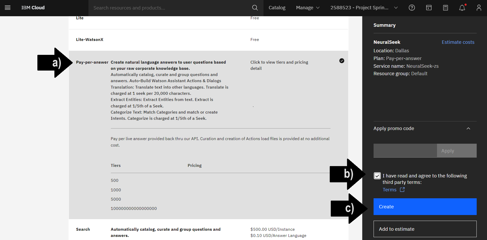
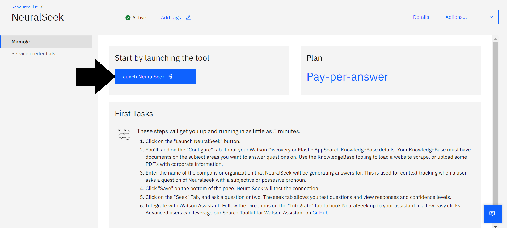
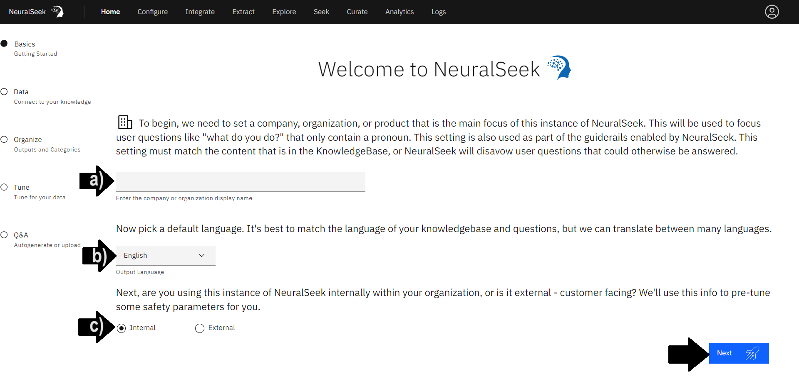
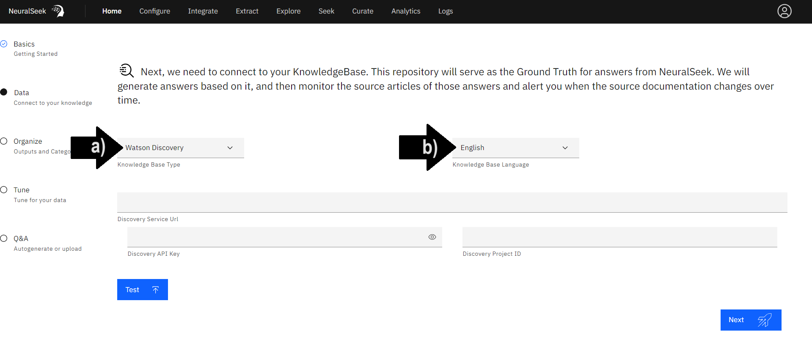
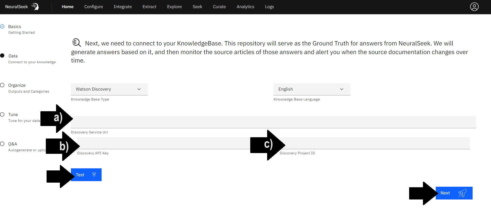
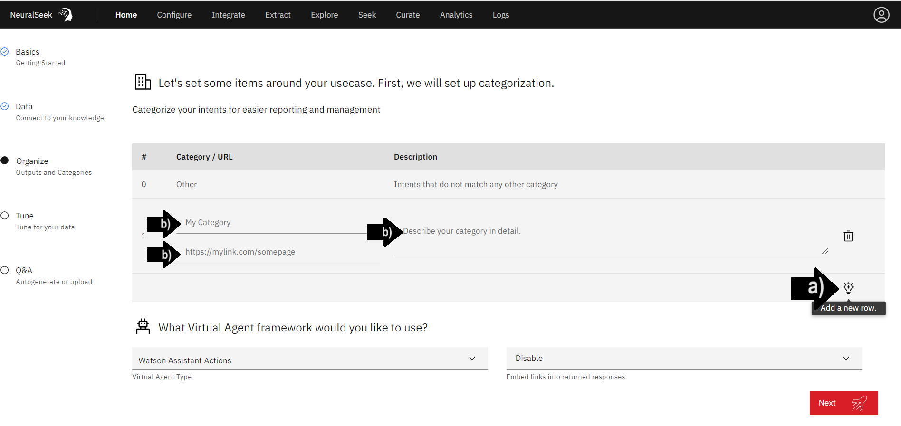
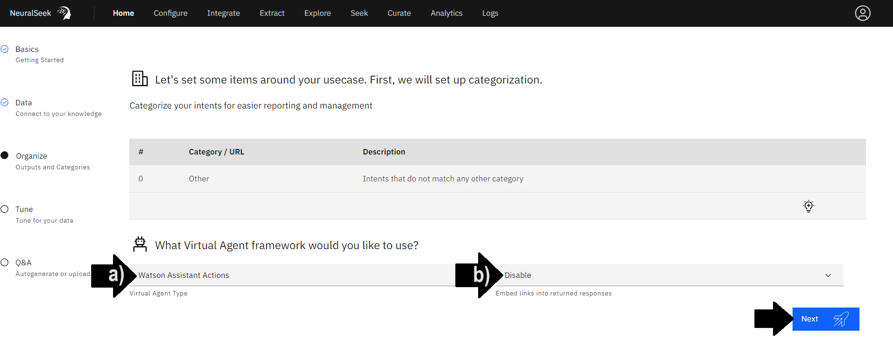

# Module 1.1 - Setup NeuralSeek

## Add NeuralSeek

Log in to [IBM Cloud](https://cloud.ibm.com/login?cm_sp=ibmdev-_-developer-_-trial&_gl=1*1odtrhw*_ga*NTM2NzU0MTk0LjE2OTY1MjE4NDQ.*_ga_FYECCCS21D*MTY5Njg2NzU0Ni41LjEuMTY5Njg2ODg5OS4wLjAuMA..). Search and select [NeuralSeek](https://cloud.ibm.com/catalog/services/neuralseek?cm_sp=ibmdev-_-developer-_-trial) from Catalog. 
- **(a)** Select the **Pay-per-answer** plan type. 
- **(b)** To agree to the third-party terms, in the bottom right, open and read the terms then check, “I have read and agree to the following third-party terms”. 
- **(c)** To provision, click “Create”.

> Please note that users are responsible for all incurred costs.

## Launch NeuralSeek

Click “Launch NeuralSeek”.

## Basics - Getting Started
First, we need a short writeup about your company or organization, focusing on the use-case for this instance of NeuralSeek.

- **(a)** Add a brief company or organization description. 
- **(b)** Select "Output Language" from the drop down menu. In this example, select "**English**". It's best to match the language of your KnowledgeBase and questions, but NeuralSeek is able to translate between many languages.
- **(c)** Select preferred use of NeuralSeek instance. Will this instance of NeuralSeek be used internally within your organization, or is it external - customer facing? We'll use this info to pre-tune some safety parameters for you. In this example, select "**Internal**". 

## Data - Connect to your KnowledgeBase

- **(a)** Select KnowledgeBase. In this example “**Watson Discovery**”.
- **(b)** Select language. In this example "**English**".

### Add KnowledgeBase Information

User is responsible for providing selected KnowledgeBase details information. Since it takes time to set these up for yourself, we are going to be using the one that is already prepared for the learning lab, with read-only access. The actual values below will be provided during the course of this lab by the lab instructor.

Please enter the following:

- **(a)** Add "Discovery Service URL".
- **(b)** Add "Discovery API Key".
- **(c)** Add "Discovery Project ID".

Click the "Test" button to test the connection. Then, click "Next" to save KnowledgeBase configuration. 

## Organize - Outputs and Categories
### Categorization
Categorize your intents for easier reporting and management. 

> If following the live lab, skip this step! 

- **(a)** Click the light bulb icon to add a new row. 
- **(b)** Enter in a unique category name, a corresponding URL, and a detailed description of the category with intents that do not match any other category.

### Virtual Agent Framework
- **(a)** Select "Virtual Agent Type" from the drop down menu. In this example, select "**Watson Assistant Actions**".

- **(b)** Select preferred choice of enabling or disabling embedding links into returned responses. In this example, select "**Disable**". 

Click "Next" to save reported categories and the selected Virtual Agent. 

## Tune - Tune for your Data

Let's tune NeuralSeek for your data.

- **(a)** Select the preferred option for "Which of these looks more like your data?". For this example, select "**Important phrases are surrounded by many lines of text that explain them.**". 
    - The option "*Important phrases are surrounded by many lines of text that explain them*", describes data with more elaborate explanations with more extensive passages of text for a better understanding.  
    - The option "*Important phrases are surrounded by only a line or two of relevant information*", describes data with concise coverage of key phrases with just a line or two of necessary context. 
- **(b)** Select the preferred option that best describes your data requirements. For this example, select "**I want to give lots of information to the LLM, and give it leeway to decide the answer.**"
- **(c)** Select the preferred option that best describes your data currency. For this example, select "**All of my documents are current and relevant.**". 
    - The option "*All of my documents are current and relevant*", describes data that is up-to-date.
    - The option "*I have lots of old documents or blog posts, some with conflicting information. I need NeuralSeek to help with date prioritization*", describes data that may have conflicting or irrelevant details across different sources or documents.

Click "Next" to save reported tuning configurations. 

## Ready

NeuralSeek is ready to seek.

> NeuralSeek is now set up and ready to use. 