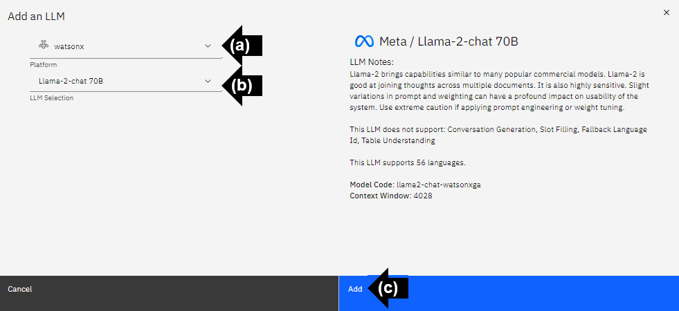

# Connect a Large Language Model (LLM) with NeuralSeek

Enhance your NeuralSeek experience by following these instructions to seamlessly add at least one LLM (Large Language Model) to optimize its functionalities. If you add more than one, NeuralSeek will balance them for functions that can use multiple LLMs. If an LLM can't handle certain features, those features won't be available. If you don't add an LLM for a function, that part of NeuralSeek won't work.

> ⚠ In order to configure a LLM, make sure that you have subscribed to the Bring Your Own LLM (BYOLLM) plan. All other plans will default to NeuralSeek’s curated LLM, and this option will not be available. Remember, it is the responsibility of each participant to understand and manage the associated costs related to the use of NeuralSeek and any other integrated services within their IBM Cloud environment.

## Add an LLM

Navigate to the NeuralSeek user interface.

In the "Home" tab, follow the steps to connect to your LLM.

> ⚠️ You must add at least one LLM.

- **(a)** Click "Add an LLM"". 

## Platform and LLM Selection

For IBM users, it is recommended to connect to the **watsonx** platform, and the **Llama-2-chat 70B** LLM selection. 

- **(a)** Click the drop down menu to select the LLM platform. For this example, select "**watsonx**". 
- **(b)** Click the drop down menu to select the LLM. For this example, select "**Llama-2-chat 70B**". 
- **(c)** Click "Add" to add the LLM. 

## LLM Functions

> Location of watsonx IAM API Key, Endpoint URL, and Project Id information can be found on your IBM Cloud account within the active instance found in the Resource List.

- Enter the watsonx IAM API Key.
- Enter the watsonx Endpoint URL.
- Enter the watsonx Project Id.
- Enable available LLM languages. NeuralSeek will default to enable all 56 available languages. 
- Select desired LLM functions. NeuralSeek will default to select all available functions. For the purpose of this lab, select the following: **PII Detection, Conversation Generation, Entity Extraction, Categorization, Example Generation, Intent Creation, Translate, Fallback Sentiment,** and **Explore**. 

## Test the LLM

- Click "Test" to test the LLM. 

A Large Language Model is now connected to NeuralSeek. 

> ⚠️ LLM's can vary in their capabilities and performances. Some LLM can take up to 30 seconds and longer to generate a full response. Use caution when using in conjunction with a virtual agent platform that imposes a strict timeout.