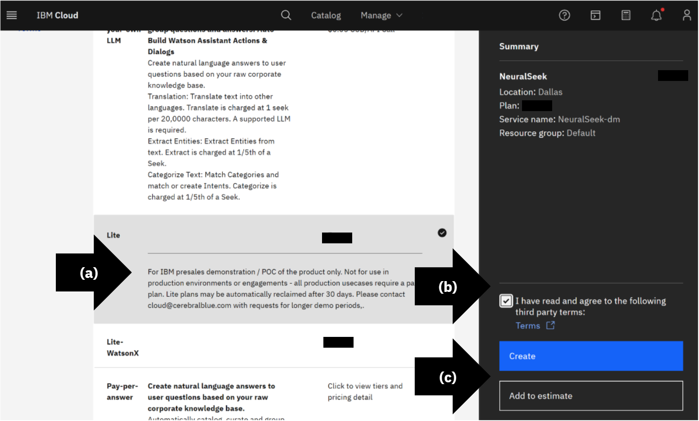
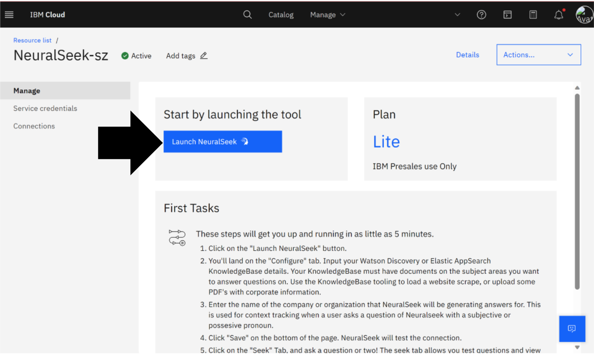
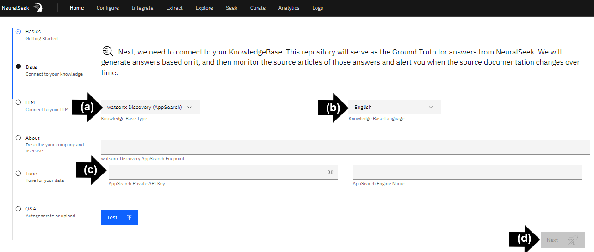

# Configure wastonx Discovery (AppSearch) KnowledgeBase

This section outlines how to establish a successful connection between the watsonx Discovery (AppSearch) KnowledgeBase and NeuralSeek.

## Access NeuralSeek UI

Log in to [IBM Cloud](https://cloud.ibm.com/login?cm_sp=ibmdev-_-developer-_-trial&_gl=1*1odtrhw*_ga*NTM2NzU0MTk0LjE2OTY1MjE4NDQ.*_ga_FYECCCS21D*MTY5Njg2NzU0Ni41LjEuMTY5Njg2ODg5OS4wLjAuMA..). Search and select [NeuralSeek](https://cloud.ibm.com/catalog/services/neuralseek?cm_sp=ibmdev-_-developer-_-trial) from Catalog. 
- **(a)** Select a plan type. 
- **(b)** To agree to the third-party terms, in the bottom right, open and read the terms then check, “I have read and agree to the following third-party terms”. 
- **(c)** To provision, click “Create”.

## Launch NeuralSeek

Click “Launch NeuralSeek”.

## Basic Information

Complete required form. 

- **(a)** Enter the company name or organization display name.
- **(b)** Select output language. For the purpose of this lab we recommend English. 
- **(c)** Start training NeuralSeek AI by checking the purpose of the virtual agent. Choose “Internal” or “External”.
- **(d)** Click “Next”.

  

## Data Information

- **(a)** Select KnowledgeBase. In this example “**watsonx Discovery (AppSearch)**”.
- **(b)** Select language. In this example "**English**".
- **(c)** Enter the watsonx Discovery AppSearch Endpoint URL, Private API Key, and Engine Name. This information can be found on your IBM Cloud account within the active instance found in the Resource List.
- **(d)** Click “Next”.

> ⚠ If this is your first time setting up NeuralSeek you will be prompted to complete the Curation Tour at this time.

> NeuralSeek is now set up with a KnowledgeBase, in this case: **IBM watsonx Discovery (AppSearch)**, and ready to use. 