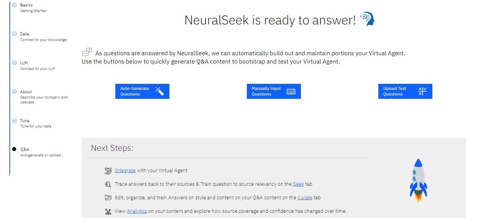

# Additional Task - Q&A

## Q&A

As questions are answered by NeuralSeek, we can automatically build out and maintain portions of your Virtual Agent.

Use the buttons below to quickly generate Q&A content to bootstrap and test your Virtual Agent.

 

- **Auto-Generate Questions** will query the KnowledgeBase, ask NeuralSeek to generate insights and output a variety of test questions based on your corporate content. Click "Submit" to have NeuralSeek generate answers. 

 

- **Manually Input Questions** will provide a blank test box for you to enter questions, one per line, based on your corporate content. Click "Submit" to have NeuralSeek generate answers. 

- **Upload Test Questions** will provide a link to your local file explorer to upload a CSV file of test questions. The questions will be run through the Seek endpoint in parallel and scored. Please use the provided downloadable .csv file as a template for your questions.  Input files must retain these column titles at a minimum, but you may add additional payload columns. Click "Submit" to have NeuralSeek generate answers. 

> NeuralSeek is now ready to answer!