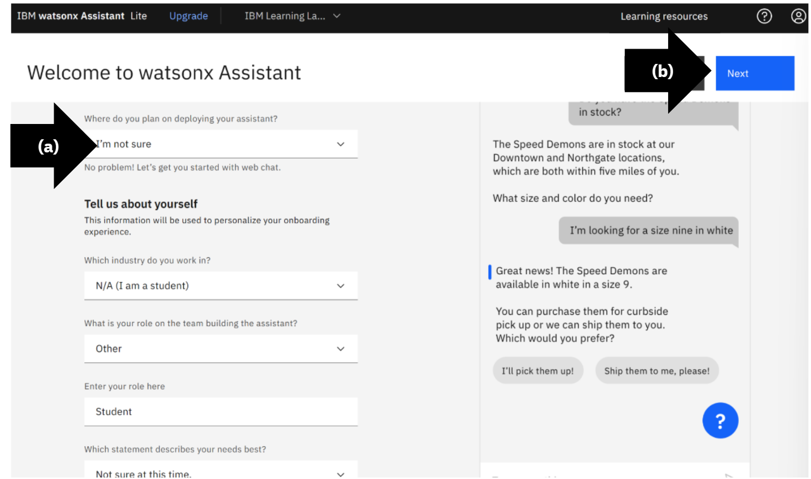

# Module 1.2: Setup watsonx Assistant

Module 1.2 is only required if you do not currently have watsonx Assistant. 
If you do have watsonx Assistant skip to [Module 1.3]({{site.baseurl}}).

## Create Resource
If you do not have watsonx Assistant, login to [IBM Cloud](https://cloud.ibm.com/login?cm_sp=ibmdev-_-developer-_-trial&_gl=1*1odtrhw*_ga*NTM2NzU0MTk0LjE2OTY1MjE4NDQ.*_ga_FYECCCS21D*MTY5Njg2NzU0Ni41LjEuMTY5Njg2ODg5OS4wLjAuMA..). 
Click “Create Resource”.

 
## Search the Catalog
Search and select “Watson Assistant”. 

## Create a Preferred Version
* (a) Select version. In this example, “Lite”.
* (b) Read the Terms and check, “I have read and agree to the following license agreements: [Terms](https://www.ibm.com/software/sla/sladb.nsf/sla/bm-0038-15)”.
* (c) Click “Create”.

## Launch watsonx Assistant
If desired, complete the “Getting Started Tutorial”. 
Click “Launch Watson Assistant”.

## Create Your First Assistant
* (a) Type assistant name. In this example, “IBM Learning Lab: NeuralSeek with Watson”
* (b) Type optional description. In this example, “Learning experience to provide an immersive and hands-on approach to understanding the complexities of Watson and NeuralSeek.”.
* (c) Select assistant language. In this example, “English”.
* (d) Click “Next”.

## Continue with the Watson Assistant
 Complete the required information. 
 * (a) Select deployment plan, industry, team role, role, needs. 
 * (b) Click “Next”.

 
 
## Customize Your Chat UI
Complete the required information. 
* (a) Type assistant name, primary color, secondary color, accent color, and upload image. 
* (b) Click “Next”.

## Preview and Create
Click “Create”.

