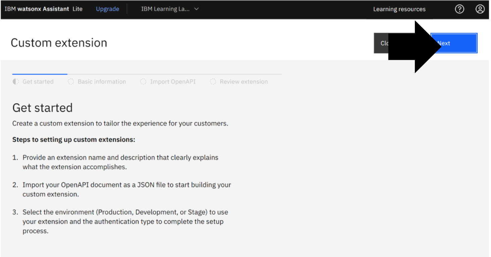
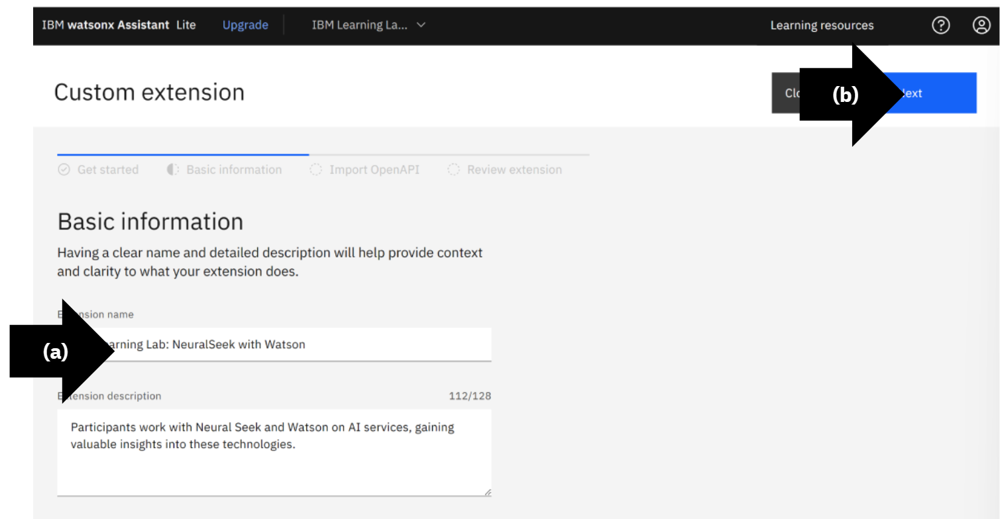
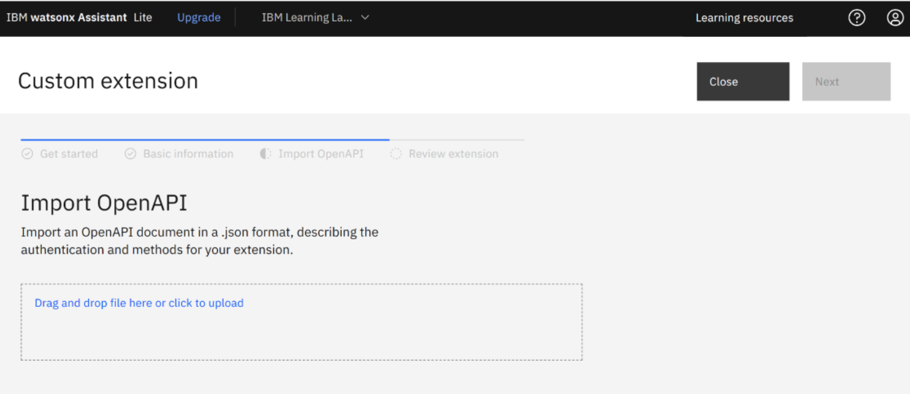
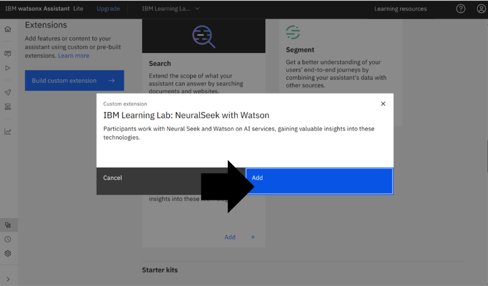

# Module 1.3: Add NeuralSeek as a Custom Extension

## Open Integrations
On the left menu, click “Integrations.”

## Open Custom Extensions
Click “Build custom extension.”

## Custom Extensions Get Started
Read the custom extension page “Get started.” 
Click “Next.”

## Basic Information
* (a) Enter in basic information, in this example the extension name is, “IBM Learning Lab: NeuralSeek with Watson” and the Extension description is, “Participants work with NeuralSeek and Watson on AI services, gaining valuable insights into these technologies.
* (b) Click “Next.”

## Custom Extension Import OpenAPI
To proceed you must add the NeuralSeek Api_file in the box “Drag and drop file here or click to upload.”

## Download the NeuralSeek OpenAPI_file
Open NeuralSeek. 
* (a) On the top menu, click “Integrate”
* (b) On the left menu, click “Watson Custom Extension.”
* (c) To download the file in point 3, click “Custom Extension OpenApi_file.
* (d) View the downloaded json in the computer download menu.

## Upload the OpenAPI_file
Return to IBM watsonx Assistant Custom extension page. 
Drag and drop or click and upload the NeuralSeek.json file into the Import OpenAPI box.

## Complete Upload
View NeuralSeek.json file. Click “Next.”

## Complete Custome Extension
Review extension. Click “Finish.”

## Return to Integrations
* (a) On the left menu, select “Integrations.”
* (b) Search for the custom NeuralSeek extension, in this example it is, “IBM Learning Lab: NeuralSeek and Watson.”
* (c) Click “+add.”

## Add Extension
Review custom extensions. Click “Add.”

