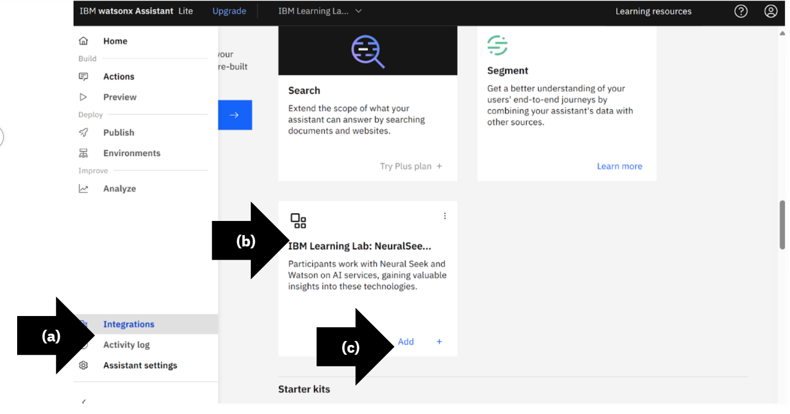
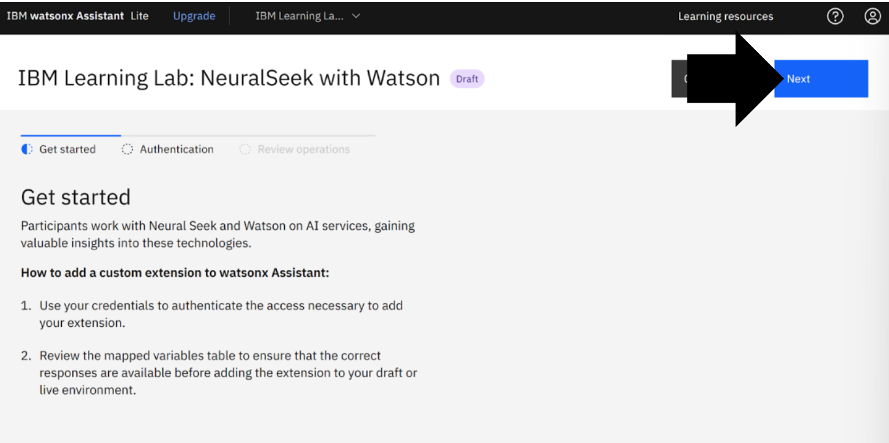
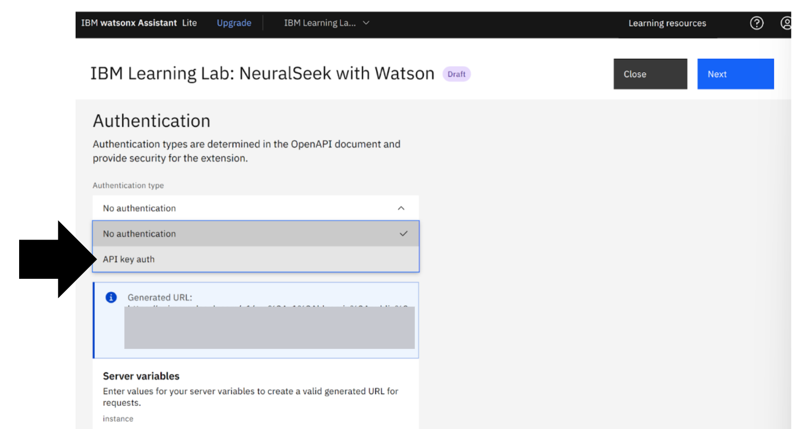
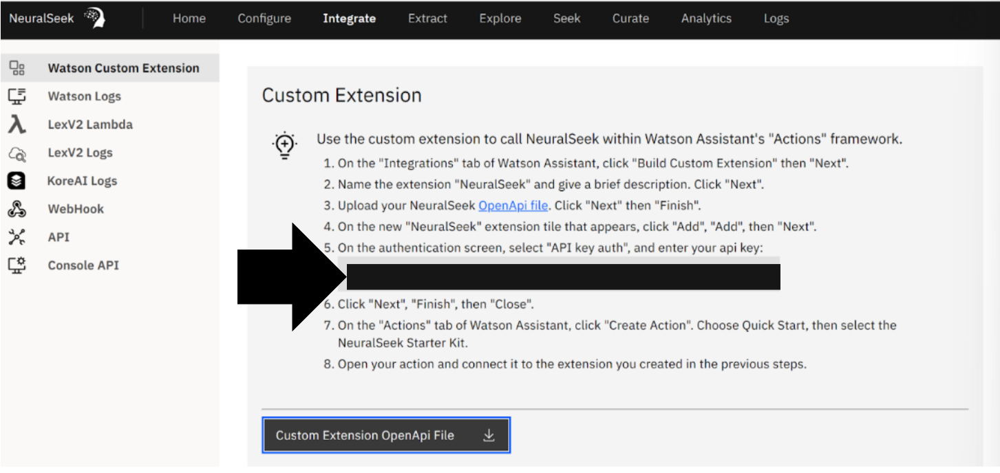
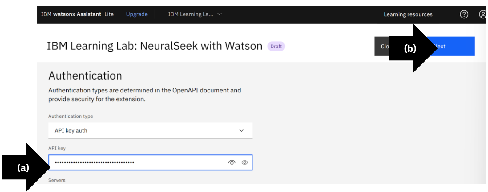

# Module 1.4: Authenticate NeuralSeek with watsonx Assistant

## Get Started

Authenticate NeuralSeek with watsonx Assistant.
In this example it is, “**IBM Learning Lab: NeuralSeek with Watson**”.

## Navigate to Integrations

- **(a)** On the left menu, select “Integrations.”
- **(b)** Search for the custom NeuralSeek extension, in this example it is, “**IBM Learning Lab: NeuralSeek and Watson.**”
- **(c)** Click “+add.”

## Add Extension

Review custom extensions. Click “Add.”

> NeuralSeek is now added as a custom extension and integrated with the virtual agent **IBM watsonx Assistant**. 

View Get started. Click “Next”.

## Authentication Page

Select authentication type as “API Key auth.”

## Retrieve API key auth from NeuralSeek

Return to NeuralSeek custom extensions. On line 5, copy the API key for the “API key auth”.

## Paste API key

Return to IBM watsonx Assistant. 
- **(a)** Paste the NeuralSeek API key into the API key text box.
- **(b)** Click “Next”.

## Complete the Authentication

Review the authentication. 
Click “Finish”. When it has updated, click “Close”.

> The custom NeuralSeek extension integrated with IBM watsonx Assistant is now authenticated and ready for use. 