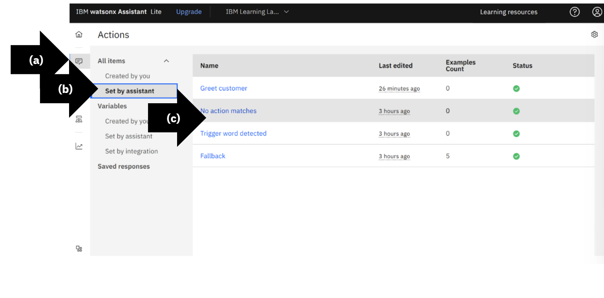
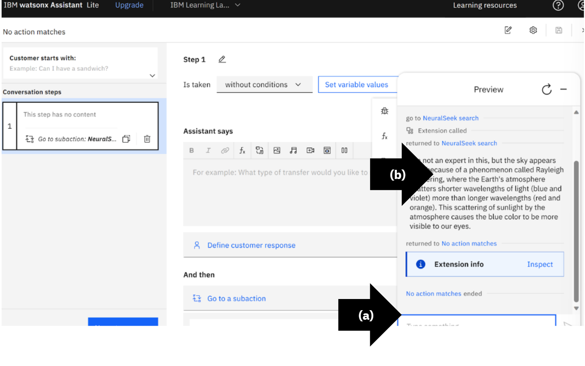

# Module 1.6: Change Default to Generative AI Responses

## Generative AI Reponses
Setup a NeuralSeek call action to use have generative AI respond to all queries, even questions not listed in Watsonx Assistant. 

* (a) On the left menu, select “Actions”.
* (b) Under All items, select “Set by assistant”.
* (c) Select “No action matches”.
  
*No action matches are cases when a user asks a question not listed in IBM Watsonx Assistant predefined responses*.

## Delete 2 No Action Matches Count
On the left menu, on step 2, click the “Trashcan” icon.

## Confirm Delete
Click “Delete”. Wait for the system to train.

## Delete Conditions
* (a) On the left menu, click 1.
* (b) Delete the condition, on the right side of conditions “if _ of this is true:_ and_” click the “x”.
 

## Open Preview
Click “Preview”.

## View Default Responses Before Setting Up NeuralSeek Call
* (a) Type a random question, in this example it is, “Why is the sky blue?”
* (b) Press “Enter”.
  
View the watsonx Assistant’s default response, “I’m afraid I don’t understand. Please rephrase your question.” This is to test that the fallback action is being triggered properly.

## Delete Default Response
In the assistant text box, delete “I’m afraid I don’t understand. Please rephrase your question.”.

## Add Subaction
* (a) Scroll to “And then”, click “End the action”.
* (b) Select “Go to a subaction”.

## Go to a Subaction
Select “NeuralSeek search".

## Check Action
* (a) Check “End this action after the other action is completed”.
* (b) Click “Apply”.

## Preview NeuralSeek Generative AI Response
* (a) In the lower right, click “Preview” and type a random question, in this example it is, “Why is the sky blue?”
* (b) Press “Enter”.

View the NeuralSeek generative AI response.

