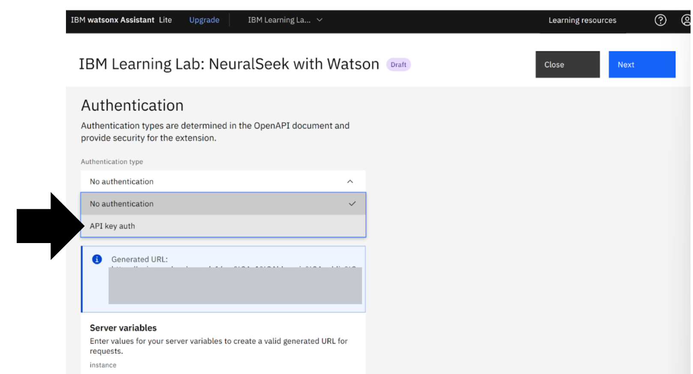
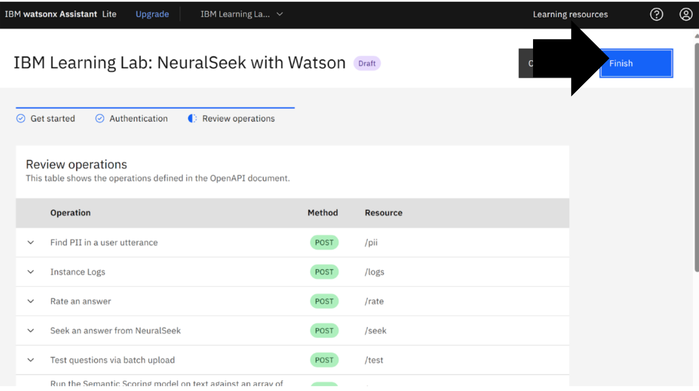

# Module 1.4: Authenticate NeuralSeek with watsonx Assistant

## Get Started
Authenticate NeuralSeek with watsonx Assistant.
In this example it is, “IBM Learning Lab: NeuralSeek with Watson”.
View Get started. Click “Next”.

## Authentication Page
Select authentication type as “API Key auth.”

## Retrieve API key auth from NeuralSeek
Return to NeuralSeek custom extensions. On line 5, copy the API key for the “API key auth”.

## Paste API key
Return to IBM watsonx Assistant. 
* (a) Paste the NeuralSeek API key into the API key text box.
* (b) Click “Next”.

## Complete the Authentication
Review the authentication. 
Click “Finish”. When it has updated, click “Close”.

