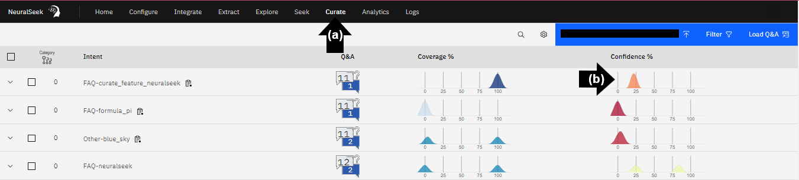
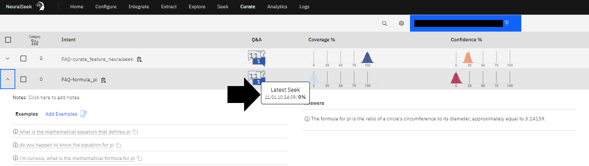

# Module 2.1 - NeuralSeek Seek

## Preview

Login to a user preferred virtual agent.
- **(a)** In the bottom left corner, click “Preview.” Type a question in the text box, in this example, “What is NeuralSeek's Curate feature?” Press “Enter.” 
- **(b)** Review NeuralSeek AI Natural Language Generated Response. 
- **(c)** To view the data source, click the blue text.

## View chatbot preview questions in NeuralSeek

Login to the NeuralSeek User Interface. 
- **(a)** On the top menu, click the “Curate” tab. 
- **(b)** View response and interact with the automated recommendations and analytics.

## Compare Coverage Score

View the high coverage score for the question, “What is NeuralSeek's Curate feature?”, while the Coverage Score for the question, “What is the formula for pi?” is low. There is no source information in the selected KnowledgeBase on the formula for pi, but there is source information on NeuralSeek's features.

## Seek a question not in the KnowledgeBase

- **(a)** On the top menu, click “Seek.” 
- **(b)** In the text box type the question, in this example, “What is the formula for pi?” 
- **(c)** Click “Seek.” 
- **(d)** View the low KnowledgeBase Confidence and KnowledgeBase Coverage. There is no content in the selected KnowledgeBase resources on the formula for pi. 

## Compare Confidence Score

- **(a)** In the text box type the question, in this example, “What is NeuralSeek's Seek feature?” 
- **(b)** Click “Seek.” 
- **(c)** View the large and highlighted text in the Generative AI response, this response is generated from content found in the selected KnowledgeBase resources.

## View content

- **(a)** Match the colors. The color of the highlighted text in the AI-generated response matches the listed KnowledgeBase content. 
- **(b)** View the high alignment in this example, most content is over 95% with a few resources at or near 90%.

## Compare a more nuanced question

- **(a)** Type, “Why should I use NeuralSeek with a KnowledgeBase instead of just ChatGPT?” into the search bar and click "Seek". 
- **(b)** View the single words highlighted in multiple colors. Unlike the question, “What is NeuralSeek's Seek feature?”, this response is key words and reference materials.

## Seek information

Scroll down to view the Total Response Time, Semantic Match, Semantic Analysis, KnowledgeBase Confidence, KnowledgeBase Coverage, KnowledgeBAse Response Time, KnowledgeBase Results, and KnowledgeBase Context.

## Additional descriptions

- **(a)** On the right side, click the caret symbol. 
- **(b)** View the actual source, click the blue text.

## Ask additional questions

- **(a)** Ask a variety of questions.
