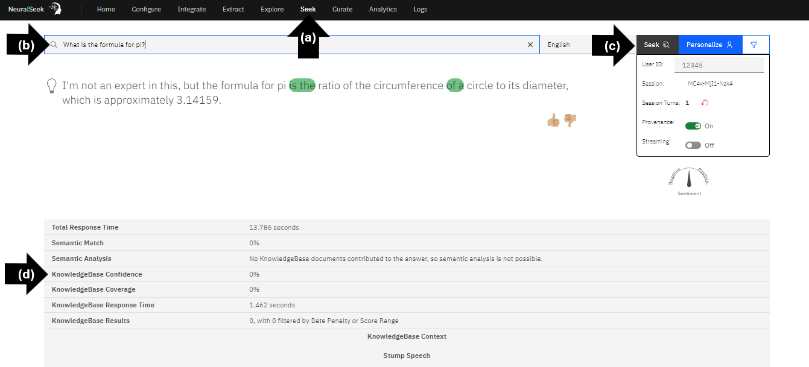
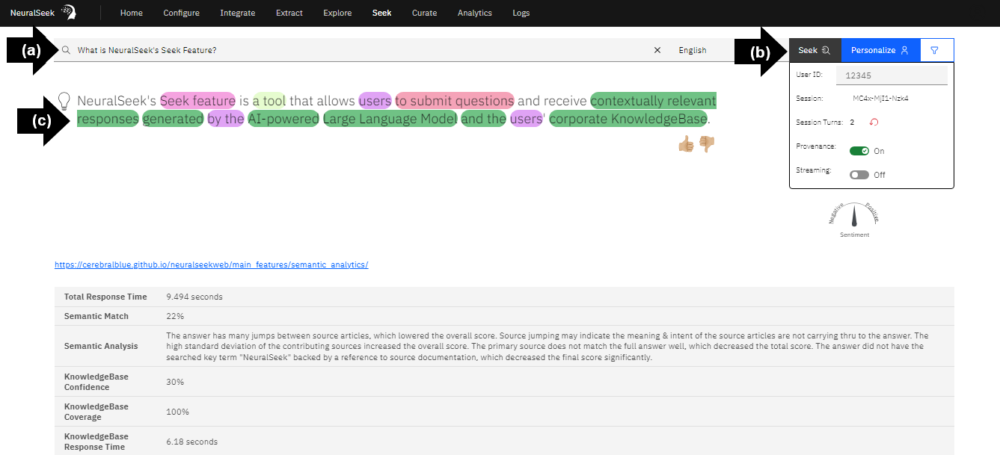
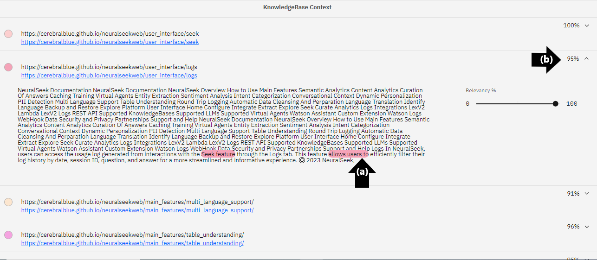
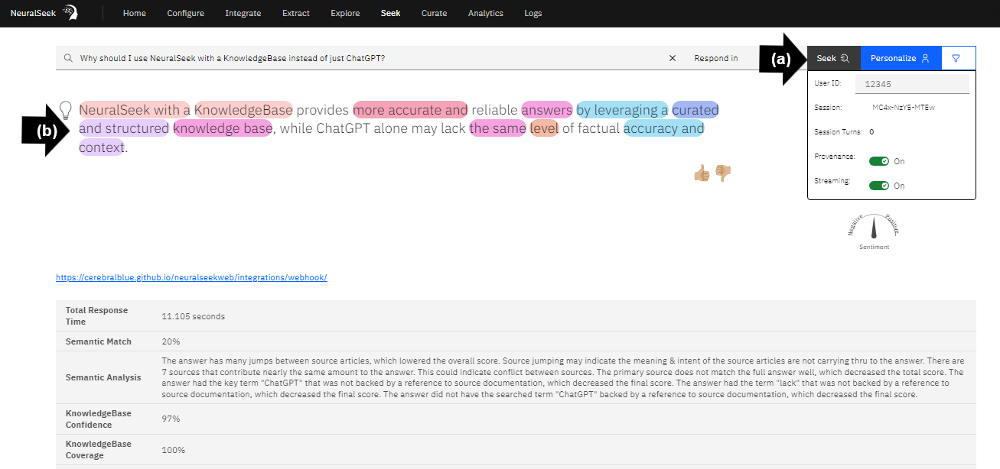
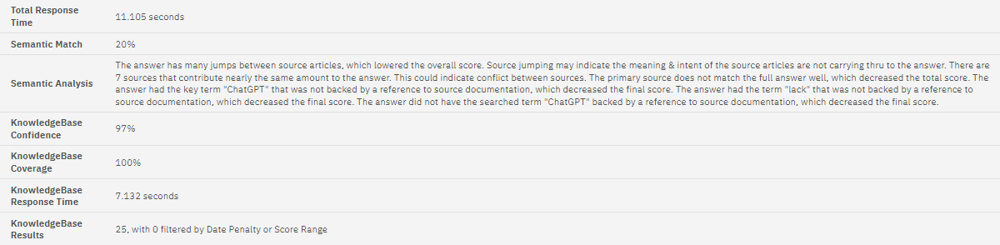
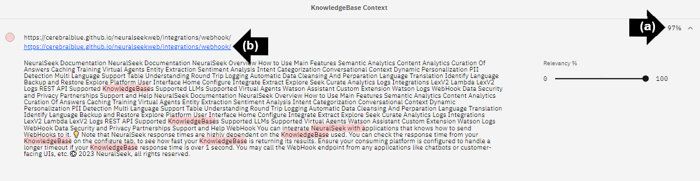

# Module 2.1 - NeuralSeek Seek

NeuralSeek's Seek feature enables users to test questions and generate answers using content from their connected KnowledgeBase. To ensure transparency between the sources and answers, NeuralSeek reveals the specific origin of the words and phrases that are generated. Semantic match scores are employed to compare the generated responses with the original documentation, providing a clear understanding of the alignment between the response and the meaning conveyed in source documents. This process ensures accuracy and instills confidence in the reliability of the responses generated by NeuralSeek.

## Seek a question not in the KnowledgeBase

- **(a)** On the top menu, click “Seek.” 
- **(b)** In the text box type the question, in this example, **“What is the formula for pi?”**[^1]. 
- **(c)** Click “Seek.” 
- **(d)** View the low KnowledgeBase Confidence and KnowledgeBase Coverage. There is no content in the selected KnowledgeBase resources on the formula for pi. 

## Compare Confidence Score

Ask a question based on the content in the connected KnowledgeBase.

- **(a)** In the text box type the question, in this example, **“What is NeuralSeek's Seek feature?”**[^1]. 
- **(b)** Click “Seek.” 
- **(c)** View the large and highlighted text in the Generative AI response, this response is generated from content found in the selected KnowledgeBase resources.

## View content

- **(a)** Match the colors. The color of the highlighted text in the AI-generated response matches the listed KnowledgeBase content. 
- **(b)** View the high alignment in this example, most content is over 95% with a few resources at or near 90%.

## Compare a more nuanced question

- **(a)** Type, “**Why should I use NeuralSeek with a KnowledgeBase instead of just ChatGPT?**[^1]” into the search bar and click "Seek". 
- **(b)** View the single words highlighted in multiple colors. Unlike the question, “**What is NeuralSeek's Seek feature?**[^1]”, this response is key words and reference materials.

## Seek information

Scroll down to view some key insights related to the generated answer. 

| **Total Response Time**         | This number indicates the total amount of time for a response to generate in seconds. | 
| **Semantic Match %**            | This percentage is the overall match score that indicates how much NeuralSeek believes that the responses are well aligned with the underlying ground truth from the KnowledgeBase. The higher the percentage is, the more accurate and relevant the answer is based on the truth. 
| **Semantic Analysis**           | A summary describing why NeuralSeek calculated the matching score in an easy-to-understand syntax. This gives users a good understanding why the answer was given either a high or low score.
| **KnowledgeBase Confidence %**  | This percentage indicates how confident the KnowledgeBase thinks the retrieved sources are related to the given question.
| **KnowledgeBase Coverage %**    | This percentage indicates how much coverage the KnowledgeBase thinks the retrieved sources are related to the given question.
| **KnowledgeBase Response Time** | This number indicates the amount of time for the KnowledgeBase to generate a response in seconds. 
| **KnowledgeBase Results**       | This number indicates the amount of retrieved sources the KnowledgeBase thinks are related to the given question.

## Additional descriptions

NeuralSeek provides a brief description of each source referenced in the KnowledgeBase. 

- **(a)** Click on the top section to expand the details. 
- **(b)** To view the actual source, click the blue text.

## Ask additional questions

Optionally, ask a variety of questions that pertain to your knowledge source to continue exploring. Here are some sample questions to ask based on our NeuralSeek KnowledgeBase:
- How does NeuralSeek protect private information? [^1]
- What languages does NeuralSeek support? [^1]
- Why is user intent categorization important?[^1]

[^1]: ❕ Use the example question below if the KnowledgeBase is connected with NeuralSeek documentation. 