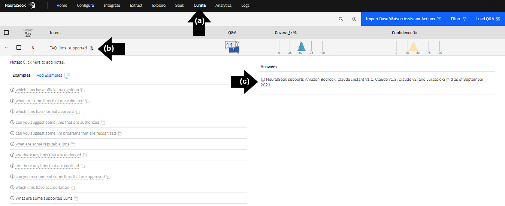
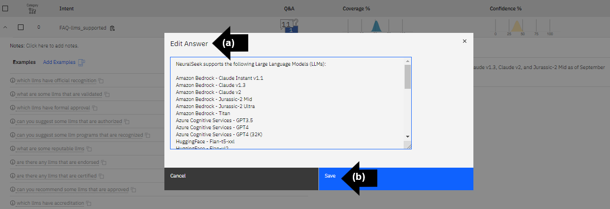

# Module 2.2 NeuralSeek Curate

## Correcting wrong answers
- **(a)** On the top menu, click “Curate.” 
- **(b)** Select the intent “FAQ-analytics_developments_aws_technology,” click the dropdown caret symbol. 
- **(c)** Read the answer. In this example, NeuralSeek generated an inaccurate answer because the content in KnowledgeBase is outdated.

## Human overview to manually correct Generative AI responses. 
- **(a)** Click the text box to update the answer for accuracy. 
- **(b)** Click “Save.”

## Additional actions. 
Check desired seeks. In this example, bio analytics and blue sky. Click “Delete” to remove. OR. Click “Merge” to merge with other checked seeks. OR. Click “Flag” to return to later. OR. Click “Download to CSV” to collaborate with experts. OR. Click “Edit Category” to place into a category.