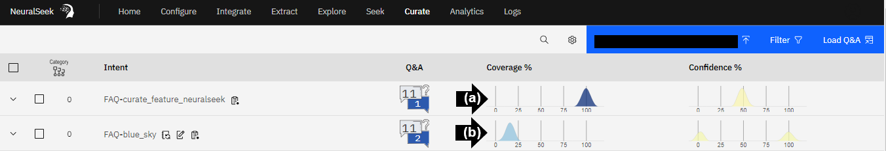

# Module 2.2 NeuralSeek Curate

As users ask questions to NeuralSeek, their questions and the generated answers will appear in NeuralSeek's Curate section. Questions will be grouped into recommended intents and it is important to note that a questions and answer pair may exist in multiple proposed intents of different specificity. It is up to you to choose which specificity level is best for your usecase. 

## View chatbot preview questions in NeuralSeek

Login to the NeuralSeek User Interface. 

- On the top menu, click the “Curate” tab. 

## Compare Coverage Score

Users are able to compare coverage scores between intents. 

- **(a)** Compare the high coverage score for the question, “**What is NeuralSeek's Curate feature?**”.
- **(b)** Compare the low coverage score for the question, “**Why is the sky blue?**”. 

There is no source information in the selected KnowledgeBase on why the sky is blue, but there is source information on NeuralSeek's features, which explains the difference in coverage scores.

## Caching
NeuralSeek uses caching strategy when searching through a corporate KnowledgeBase to enhance performance and reduce computational cost during its operation. NeuralSeek also utilizes two types of caches for both your edited answers and generated answers that can serve cached answers to user questions in order to speed up response times and produce more consistent results.

Navigate to the "Configure" tab in NeuralSeek.

- **(a)** Click "Intent Matching & Cache Configuration". 
- **(b)** Set "Normal Answer Cache" to 1. 

## Inaccurate Answer Example
 
- **(a)** Select an intent by clicking the dropdown caret symbol. 
- **(b)** Read the answer generated for that specific intent. It is possible for NeuralSeek to generate an inaccurate answer because the content in KnowledgeBase is outdated.

## Human overview to manually correct Generative AI responses. 

You can edit any answer, and the edited response will be used when you curate and export into a virtual agent. Edited responses are also used to train future generated answers.

- **(a)** Click the text box to update the answer for accuracy. Add this text to the answer: 
> It continuously tracks and compares the generated responses with the source documents to determine if any changes have occurred. By doing so, NeuralSeek ensures that the answers remain up-to-date and relevant. This eliminates the need for manual intervention and the potential for outdated information, allowing users to trust the accuracy and currency of the answers provided.
- **(b)** Click “Save.”

## Additional actions

When you click one of the answers, the system automatically notifies you of actions you may perform on the row via the blue toolbar above.

- **(a)** check one of the anwers 

- Click “Delete” to remove.
- Click “Merge” to merge with other checked seeks.
- Click “Flag” to return to later.
- Click “Download to CSV” to collaborate with experts.
- Click “Edit Category” to place into a category.
- Click "Export" to download a .json file for uploading to your virtual assistant.
- Click "Import" to upload a .json file from your virtual assistant into NeuralSeek.  

