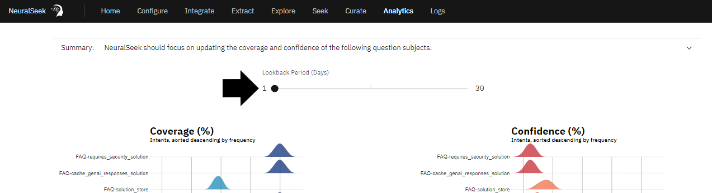
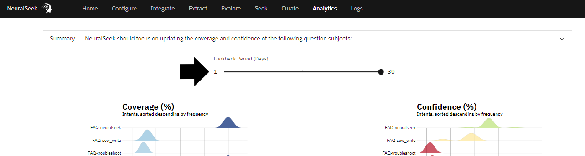

# Module 2.3 NeuralSeek Analytics

Users can work backwards from the "Analytics" tab to see and understand where the confidence and coverage scores of different actions are coming from. The analytics feature reveals the relationship between each action’s coverage and confidence scores, and can direct users to each specific action found in the “Curate” section of NeuralSeek's user inferface.

## Get an overview of the Coverage and Confidence Scores for responses

On the top menu, click “Analytics.” View the list of questions and responses. Compare the coverage and confidence scores.

> ❕ Note: Analytics page will vary depending on previous actions taken. 

## Lookback Period

Use the sliding scale to modify the time period in days. Users can see changes up to 30 days, and also note the coverage or confidence score trends.

