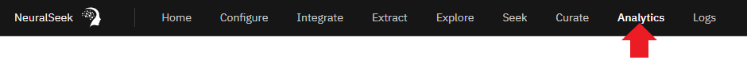
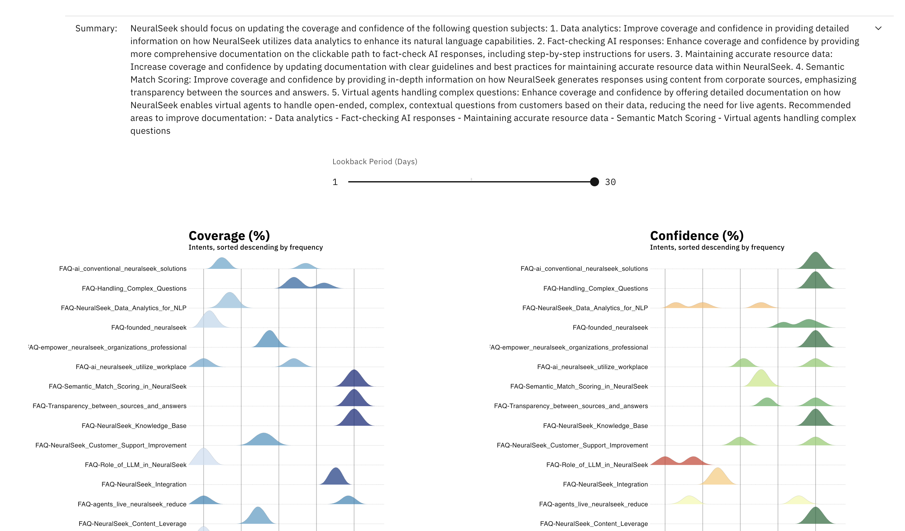

# Module 2.3 NeuralSeek Analytics

## Get an overview of the Coverage and Confidence Scores for responses

On the top menu, click “Analytics.” View the list of questions and responses. Compare the coverage and confidence scores.

## To view and compare specific responses

Click the desired response.