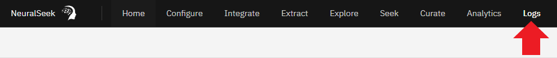
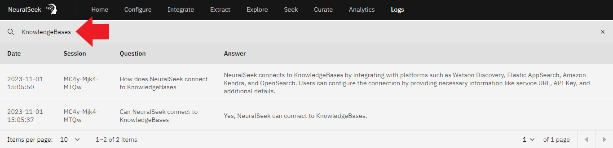

# Module 2.4 NeuralSeek Logs

In NeuralSeek, users can access the usage log generated from interactions with the “Seek” feature through the “Logs” tab. This feature allows users to efficiently filter their log history by date, session ID, question, and answer for a more streamlined and informative experience.

## View Seek and response history

On the top menu, click “Logs.” View the list of logged seeks and responses.

## Search the Logs

In the upper right corner, click “magnifying glass icon.” Type in a key word or phrase into the text box. Press “Enter.” View results.

