# Module 2.5 NeuralSeek Explore

NeuralSeek's "Explore" platform offers an open-ended playground for retrieval augmented generation. "Explore" streamlines the interaction with Language Models, making it accessible and user-friendly while providing powerful tools for content retrieval and enhancement.

## Access Explore

Explore outputs Generative AI-backed natural language responses based on prioritized data sources.

- On the top menu click “Explore.” 

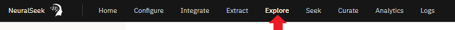

## Example 1 - Create a Marketing Email

Explore's **Visual Editor** will generate, allowing for seamless point-and-click interactions. For the purpose of this lab, prompt Explore to extract data from a website to create a marketing email. 

- **(a)** Click "Example Templates". A list of example templates to use will show.
- **(b)** Click the "Prospecting Email" template to create a marketing email. 

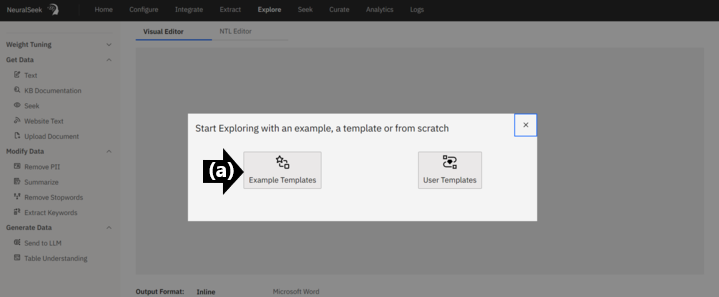

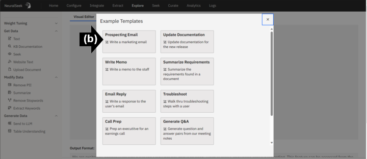

### Complete the Prompt

- **(a)** Notice, this where you can type a question or a request into the "Text" prompt. In this example it defaults to, “**Write a marketing email based on this list:**” 
- **(b)** Click “Website Text.” Copy the URL of a text-based website page and paste the URL into the prompt. In this example, use "[**https://documentation.neuralseek.com/main_features/explore_platform**](https://documentation.neuralseek.com/main_features/explore_platform)". 
- **(c)** At this step, Explore sends all previous content to the Large Language Model for generation.
- **(d)** Click “Evaluate" and review output.
> Optionally, click “Summarize" to change the word count allowance. 

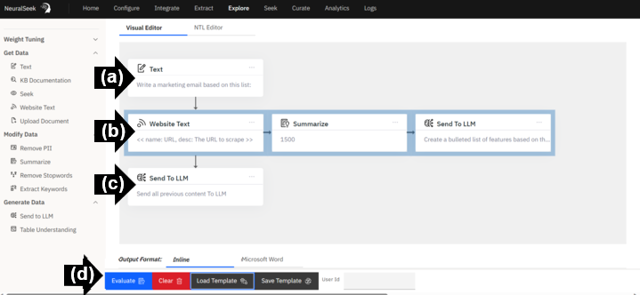

### View Output

Scroll down and read the generated response. Confirm the output is unique.

- **(a)** Click "Evaluate" to re-generate a unique response. 

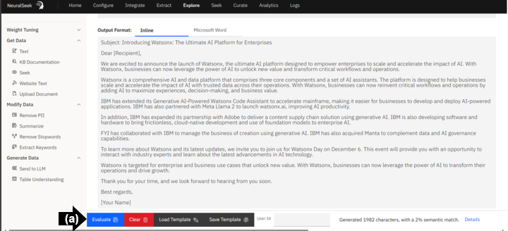

### Details

- **(a)** Click Details. View the Semanic Score Details information. 
- **(b)** Click “Close.”
- **(c)** Click "Clear" to remove the output and contents in the Visual Editior. 

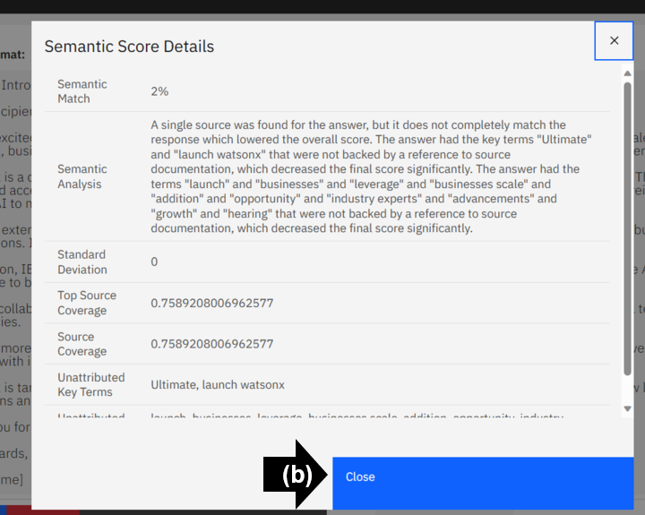

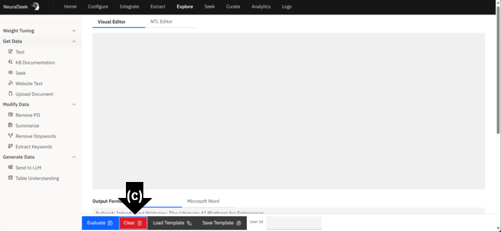

## Example 2 - Write a Memo Using a KnowledgeBase Query

Users can query KnowledgeBases and retrieve information based on specific search terms or queries.

- **(a)** In the Visual Editor, click "Load Template".
- **(b)** From the template options, click "Write a Memo". 

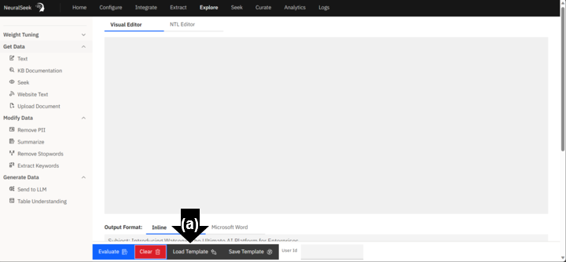

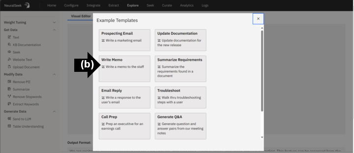

### Complete the Prompt

**(a)** Notice, this where you can type a question or a request into the "Text" prompt. In this example it defaults to, “**Write a memo to staff dicussing the following capabilities:**” 
- **(b)** Click “KB Search” to add a KnowledgeBase card. In this example, type "**Explore**" for the query to your KnowledgeBase.  
- **(c)** At this step, Explore sends all previous content to the Large Language Model for generation.
- **(d)** Click “Evaluate" and review output.

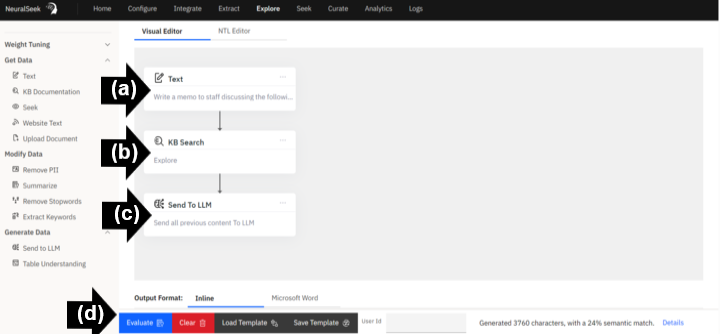

### View Output

Scroll down and read the generated response. Confirm the output is unique.

> Optionally, Click “Evaluate" to re-generate a unique response.

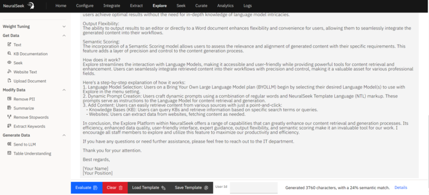

## Example 3 - Chain LLM Calls to Shorten Memo

- **(a)** Click "Send to LLM" and drag the newly created card to the right of "Send all previous content to LLM".
- **(b)** Prompt the Language Model with a specified request to modify the original memo output. Click on the newly created card and input this example prompt: "**Condense this memo to 2 paragraphs**". 
- **(c)** Click “Evaluate.” Review output.

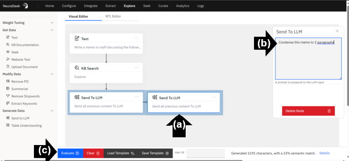

### View Output

Scroll down and read the generated response. Confirm the output is unique. Notice how to output memo is now shortened to two paragraphs in length. 

> Optionally, Click “Evaluate" to re-generate a unique response. Or, continue to chain LLM calls with various specified prompts. 

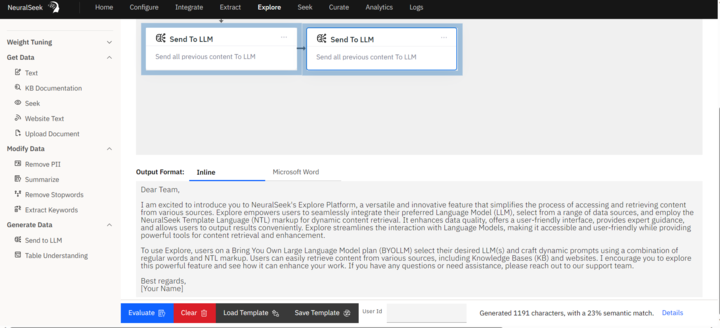

<!---## Use Data from a Document

Users can access content from local files such as PDFs, Docs, CSVs, XLS, and TXT.

- **(a)** Type a question or request in the text box. In this example, "Write a marketing email promoting this customer success story."
- **(b)** On the left menu under "Get Data", click “Upload Document.” 
- **(c)** Select the preferred document, click “Open.”

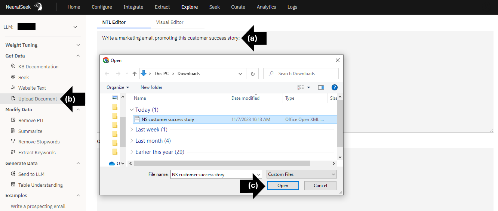

## Evaluate output

- **(a)** On the left menu, confirm document is added. 
- **(b)** Click on the document to bring the contents into the prompt. 
- **(c)** Click “Evaluate.”

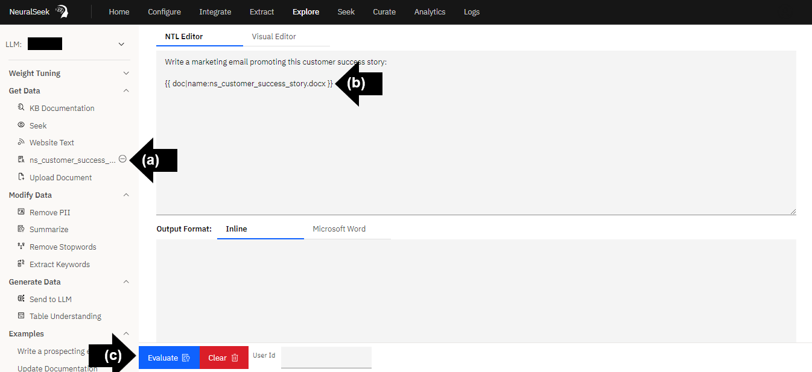

## Review details of output

Scroll down to read the generated promotional email. Notice how the output used specific information from the uploaded document throughout the response.

--->

## Continue to Explore 

Continue to explore the wide variety of output generation with various data selection options, modifications to the data, and unique generative data prompts on NeuralSeek's Explore platform.  