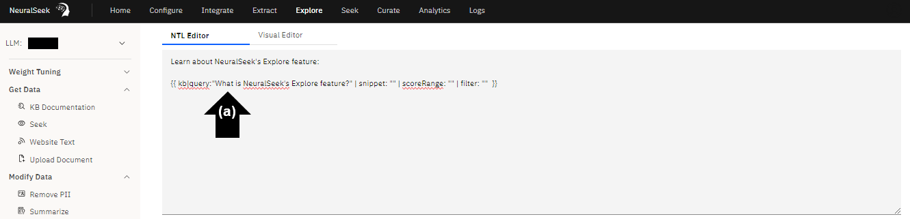
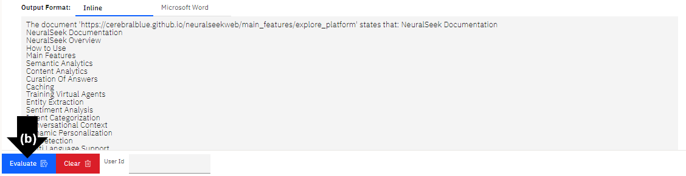
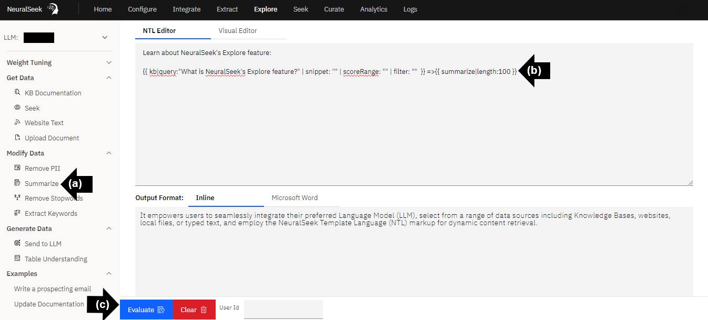
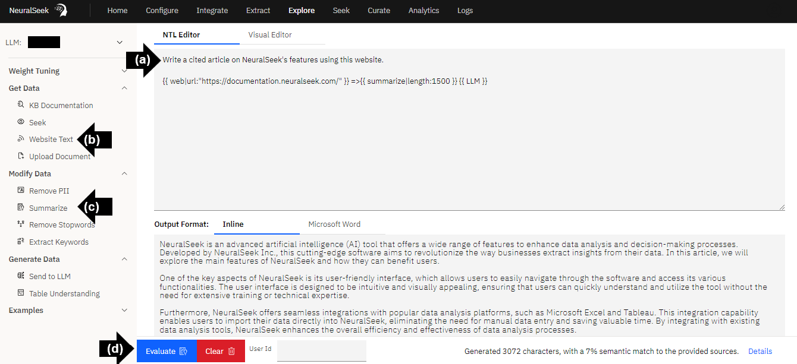
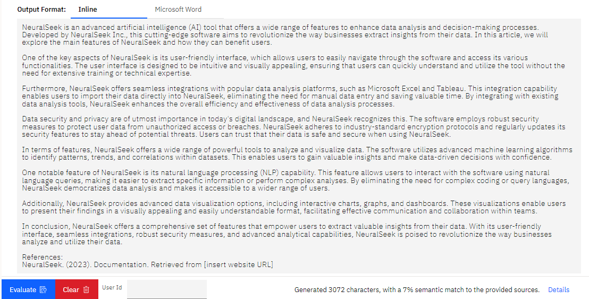

# Module 2.5 NeuralSeek Explore

## View Example

Explore outputs Generative AI-backed natural language responses based on prioritized data sources, either “Get Data,” “Modify Data,” or “Generate Data.” 

- On the top menu click “Explore.” 

- **(a)** On the left menu, select “Write a prospecting email.” View the prompt. 
- **(b)** Click “Evaluate.” 

## View output

Scroll down and read the generated response. Confirm the output is unique, click “Evaluate” again.

## Details

- **(a)** Click Details. View information. 
- **(b)** Click “Close.”

## Prioritize KnowledgeBase data

- **(a)** In the text box, type the question or request. 
- **(b)** From the left menu, under “Get Data,” select “KB Documentation.”

## View output

- **(a)** Replace “your KB query” with a brief description of the question or request. 
- **(b)** Click “Evaluate.” Review output.

## Shorten output

- **(a)** From the left menu under “Modify Data,” click “Summarize.” 
- **(b)** Replace the value with “100.” 
- **(c)** Click “Evaluate.” Review output.

## Prioritize a single document

- **(a)** Type a question or request in the text box. In this example, "Write a marketing email promoting this customer success story."
- **(b)** On the left menu under "Get Data", click “Upload Document.” 
- **(c)** Select the preferred document, click “Open.”

## Evaluate output

- **(a)** On the left menu, confirm document is added. 
- **(b)** Click on the document to bring the contents into the prompt. 
- **(c)** Click “Evaluate.”

## Review details of output

Scroll down to read the generated promotional email. Notice how the output used specific information from the uploaded document throughout the response.

## Prioritize a webpage

- **(a)** Type a question or a request, in this example it is, “Write a cited article on NeuralSeek's features using this website.” 
- **(b)** On the left menu under "Get Data", select “Website Text.” Copy the URL of a text-based website page and paste the URL into the “https://yourwebpage.com” prompt.
- **(c)** On the left menu under "Modify Data", click “Summarize.” 
- **(d)** Click “Evaluate" and review output.

## Continue to Explore 

Adjust output with data selection, modifying data, and generate data. Take time to understand the “Weight Tuning.”