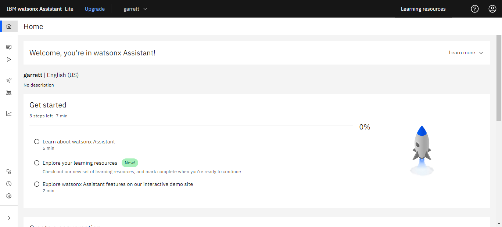
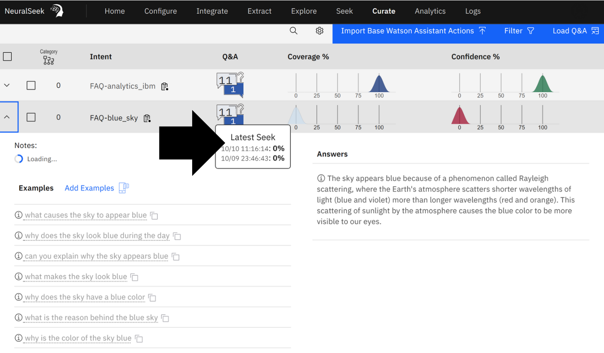
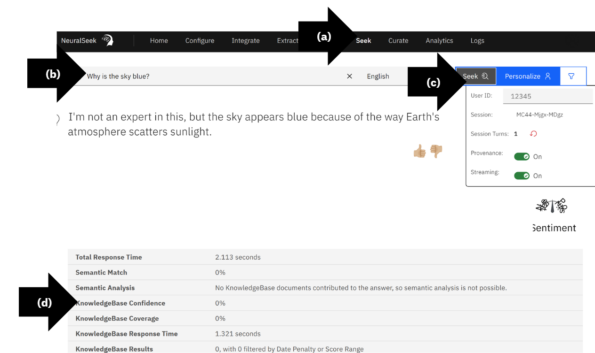
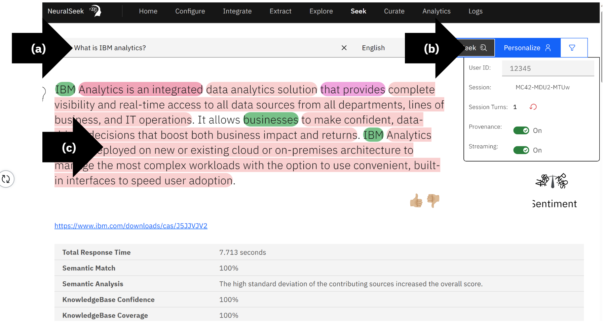
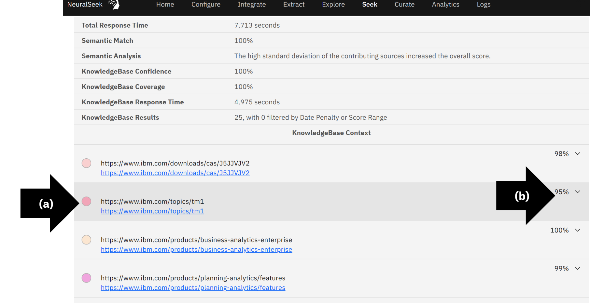
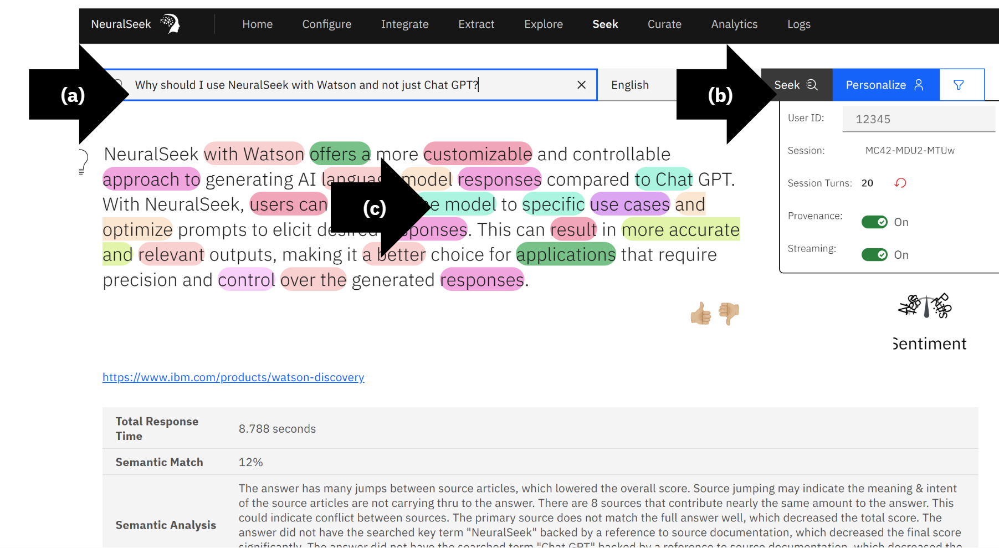
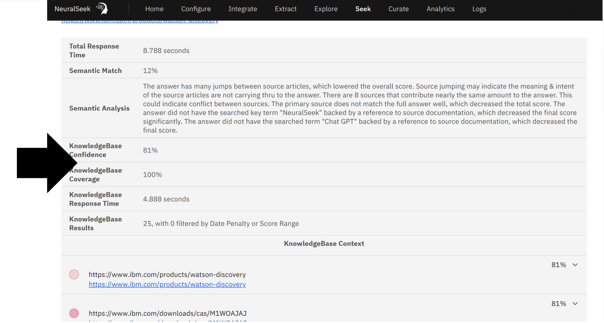
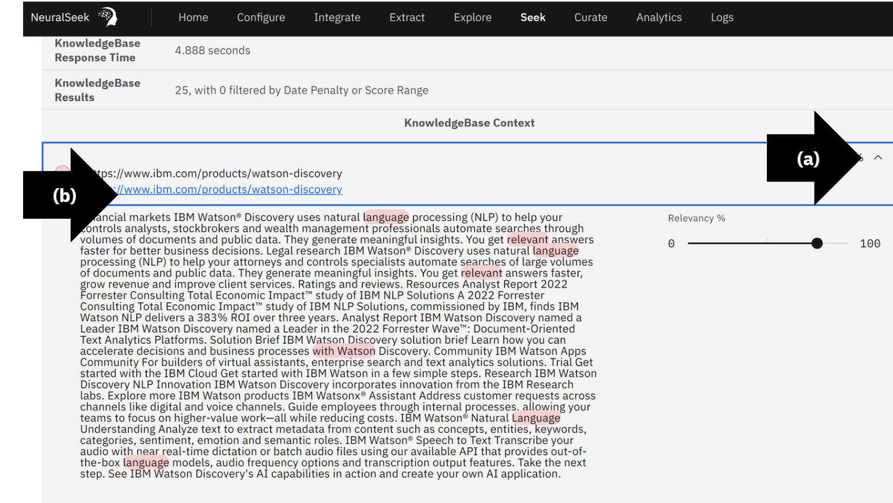
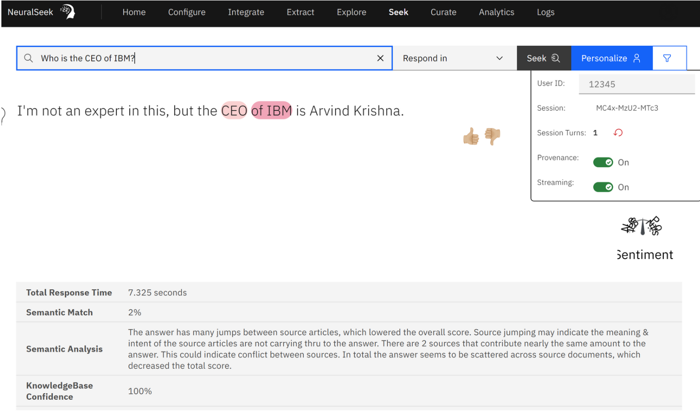

# Module 2.1: NeuralSeek Seek

## Preview
Login to [IBM Cloud](https://cloud.ibm.com/login?cm_sp=ibmdev-_-developer-_-trial&_gl=1*1odtrhw*_ga*NTM2NzU0MTk0LjE2OTY1MjE4NDQ.*_ga_FYECCCS21D*MTY5Njg2NzU0Ni41LjEuMTY5Njg2ODg5OS4wLjAuMA..). Open IBM watsonx Assistant. 

In the bottom left corner, click “Preview”. 

* (a) Type a question in the text box. In this example, “What is IBM analytics?”.
Press “Enter”. 
* (b) Review NeuralSeek AI Natural Language Generated Response.
* (c) View the data source, click the blue text.

## View Watsonx Assistant Preview Questions in NeuralSeek
Login to the NeuralSeek User Interface. 
* (a) On the top menu, click “Curate”.
* (b) View response and interact with the automated recommendations and analytics.

NeuralSeek balances AI automation and human review to maximize Watsonx AI potential.

## Compare Coverage Score
View the high coverage score for the question, “What is IBM analytics?” while the coverage score for the question, “Why is the sky blue?” is low. 
There is no source information in the selected Watson Discovery on why the sky is blue but there is source information on IBM analytics.

## Seek a Question Not in the KnowledgeBase
* (a) On the top menu, click “Seek”.
* (b) In the text box type the question. In this example, “Why is the sky blue?”.
* (c) Click “Seek”.
* (d) View the low KnowledgeBase Confidence and KnowledgeBase Coverage. There is no content in the selected Watson Discovery resources on the color of the sky.
  

## Compare Seek Coverage
* (a) In the text box type the question. In this example, “What is IBM analytics?” (b) Click “Seek.” (c) View the large and highlighted text in the AI response, this response is generated from content found in the selected Watson Discovery resources.

## View Content

## Compare a More Nuanced Question

## Seek Information

## Additional Descriptions

## Ask Additional Questions

