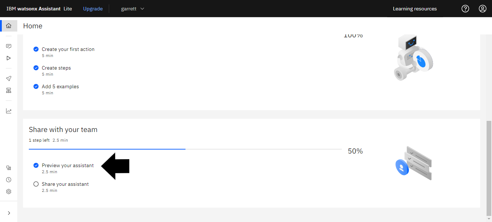
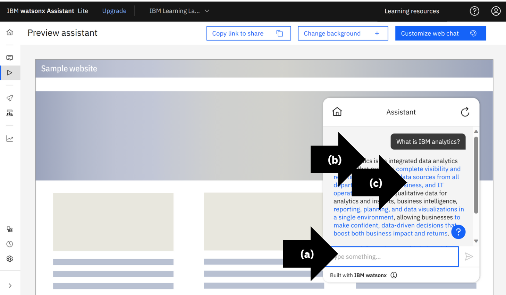
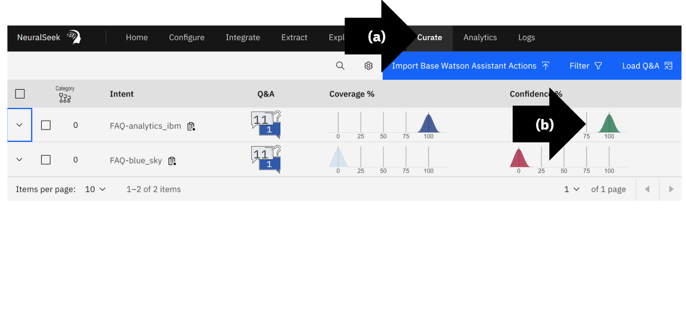

# Module 2.1: NeuralSeek Seek

### Preview
Login to [IBM Cloud](https://cloud.ibm.com/login?cm_sp=ibmdev-_-developer-_-trial&_gl=1*1odtrhw*_ga*NTM2NzU0MTk0LjE2OTY1MjE4NDQ.*_ga_FYECCCS21D*MTY5Njg2NzU0Ni41LjEuMTY5Njg2ODg5OS4wLjAuMA..). Open IBM watsonx Assistant. 

In the bottom left corner, click “Preview”. 

* (a) Type a question in the text box. In this example, “What is IBM analytics?”.
Press “Enter”. 
* (b) Review NeuralSeek AI Natural Language Generated Response.
* (c) View the data source, click the blue text.

### View Watsonx Assistant Preview Questions in NeuralSeek
Login to the NeuralSeek User Interface. 
* (a) On the top menu, click “Curate”.
NeuralSeek balances AI automation and human review to maximize Watsonx AI potential.
* (b) View response and interact with the automated recommendations and analytics.

